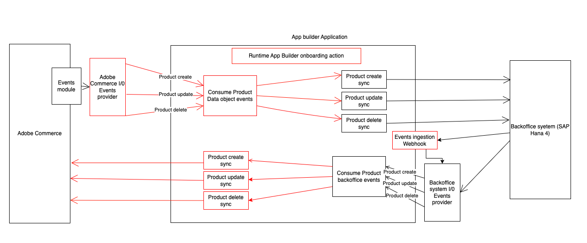
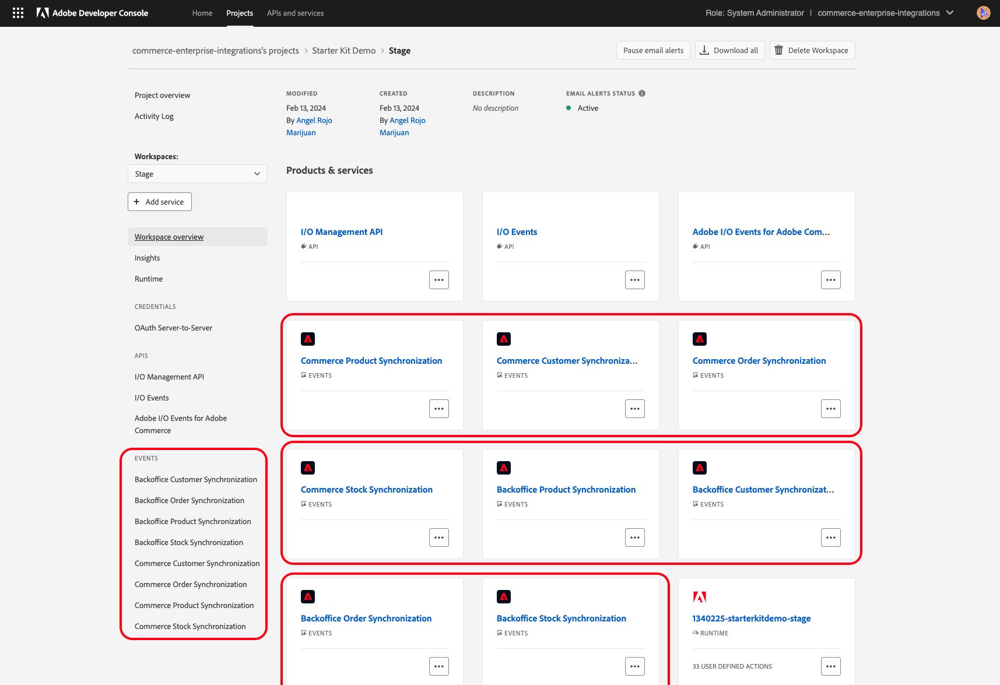

# Commerce  Integration Starter Kit

[](https://github.com/adobe/commerce-integration-starter-kit/actions/workflows/deploy_node_stage.yml)

<details>
<summary>Table of Contents</summary>

- [Commerce  Integration Starter Kit](#commerce--integration-starter-kit)
  - [Prerequisites](#prerequisites)
    - [Create App Builder project](#create-app-builder-project)
    - [Install Commerce Eventing module (only required when running Adobe Commerce versions 2.4.4 or 2.4.5)](#install-commerce-eventing-module-only-required-when-running-adobe-commerce-versions-244-or-245)
  - [Supported Auth types](#supported-auth-types)
    - [\[PaaS\] Commerce OAuth1 - Configure a new Integration in Commerce](#paas-commerce-oauth1---configure-a-new-integration-in-commerce)
    - [\[SaaS\] IMS OAuth - Add the OAuth Server to Server credentials to the environment](#saas-ims-oauth---add-the-oauth-server-to-server-credentials-to-the-environment)
    - [How to use one or another?](#how-to-use-one-or-another)
  - [Starter Kit first deploy \& onboarding](#starter-kit-first-deploy--onboarding)
    - [Download the project](#download-the-project)
    - [Configure the project](#configure-the-project)
    - [Deploy](#deploy)
    - [Onboarding](#onboarding)
      - [Configure the event registrations](#configure-the-event-registrations)
      - [Execute the onboarding](#execute-the-onboarding)
    - [Complete the Adobe Commerce eventing configuration](#complete-the-adobe-commerce-eventing-configuration)
      - [Configure Adobe I/O Events in Adobe Commerce instance](#configure-adobe-io-events-in-adobe-commerce-instance)
      - [Subscribe to events in Adobe Commerce instance](#subscribe-to-events-in-adobe-commerce-instance)
    - [Automating the execution of onboarding and event subscription](#automating-the-execution-of-onboarding-and-event-subscription)
  - [Development](#development)
    - [Project source code structure](#project-source-code-structure)
      - [`actions` folder structure](#actions-folder-structure)
      - [`entity` folder structure](#entity-folder-structure)
      - [`commerce` and `external` folders structure](#commerce-and-external-folders-structure)
      - [Individual `action` folder structure](#individual-action-folder-structure)
      - [Pass `env` params to an `action`](#pass-env-params-to-an-action)
    - [Different types of actions included in the starter kit](#different-types-of-actions-included-in-the-starter-kit)
      - [`consumer` action](#consumer-action)
      - [`event handler` action](#event-handler-action)
      - [`event ingestion` action](#event-ingestion-action)
      - [`synchronous webhook` actions](#synchronous-webhook-actions)
      - [`starter kit info` action](#starter-kit-info-action)
    - [Log management and forwarding](#log-management-and-forwarding)
      - [Prevent secrets from leaking in logs.](#prevent-secrets-from-leaking-in-logs)
    - [Testing](#testing)
    - [How to subscribe to a new event](#how-to-subscribe-to-a-new-event)
  - [Included actions documentation](#included-actions-documentation)
    - [External back-office ingestion webhook](#external-back-office-ingestion-webhook)
    - [Product entity](#product-entity)
      - [Commerce to third party](#commerce-to-third-party)
      - [Third party to Commerce](#third-party-to-commerce)
    - [Customer entity](#customer-entity)
      - [Commerce to third party](#commerce-to-third-party-1)
      - [Third party to Commerce](#third-party-to-commerce-1)
    - [Order entity](#order-entity)
      - [Commerce to third party](#commerce-to-third-party-2)
      - [Third party to Commerce](#third-party-to-commerce-2)
    - [Stock entity](#stock-entity)
      - [Commerce to third party](#commerce-to-third-party-3)
      - [Third party to Commerce](#third-party-to-commerce-3)
- [References](#references)
  - [Contributing](#contributing)
</details>

&nbsp;
Welcome to Adobe Commerce Integration Starter Kit.

Integrating an e-commerce platform with your ERP, OMS, or CRM is a mission-critical requirement. Companies can spend tens of thousands of dollars building these integrations. To reduce the cost of integrating with Enterprise Resource Planning (ERP) solutions and to improve the reliability of real-time connections, Adobe is introducing an integration starter kit for back-office integrations using Adobe Developer App Builder. The kit includes reference integrations for commonly used commerce data like orders, products, and customers. It also includes onboarding scripts and a standardized architecture for developers to build on following best practices.

The public documentation can be found at [Adobe Developer Starter Kit docs](https://developer.adobe.com/commerce/extensibility/starter-kit/integration/).



## Prerequisites

### Create App Builder project
Go to the [Adobe developer console](https://developer.adobe.com/console) portal
- Click on `Create a new project from template`
- Select `App Builder`
- Chose a name and title
- Select stage workspace or create a new one
- Add the following API services (select default Oauth server to server)
  - I/0 events
  - Adobe I/O Events for Adobe Commerce
  - I/O management API
- Download the [workspace configuration JSON](https://developer.adobe.com/commerce/extensibility/events/project-setup/#download-the-workspace-configuration-file) file and save it as `workspace.json` in the `./scripts/onboarding/config` starter kit folder because you will use it to configure Adobe IO Events in commerce afterward.
  
### Install Commerce Eventing module (only required when running Adobe Commerce versions 2.4.4 or 2.4.5) 
Install Adobe I/O Events for Adobe Commerce module in your commerce instance following this [documentation](https://developer.adobe.com/commerce/extensibility/events/installation/)

> [!TIP]
> 
> By upgrading the Adobe I/O Events for Adobe Commerce module to version 1.6.0 or greater, you will benefit from some additional automated steps during onboarding.  

## Supported Auth types

With the new announcement of **Adobe Commerce as a Cloud Service** (ACCS), requests to Commerce will now use different authentication strategies depending on the flavor you're using:

- If you're using the traditional Adobe Commerce Platform (PaaS) offering, you'll need to authenticate via OAuth1, like you've been doing until now.

- If you're using the new cloud service (SaaS) offering, you'll need to authenticate your requests using [Adobe Identity Management System](https://experienceleague.adobe.com/en/docs/experience-manager-learn/foundation/authentication/adobe-ims-authentication-technical-video-understand) (IMS).

### [PaaS] Commerce OAuth1 - Configure a new Integration in Commerce
Configure a new Integration to secure the calls to Commerce from App Builder using OAuth by following these steps:
- In the Commerce Admin, navigate to System > Extensions > Integrations.
- Click the `Add New Integration` button. The following screen displays
  
- Give the integration a name. The rest of the fields can be left blank.
- Select API on the left and grant access to all the resources.
  
- Click Save.
- In the list of integrations, activate your integration.
- To configure the starter kit, you will need the integration details (consumer key, consumer secret, access token, and access token secret).

Store the credentials in the `.env` file, these are the minimum required values:
```dotenv
COMMERCE_CONSUMER_KEY=
COMMERCE_CONSUMER_SECRET=
COMMERCE_ACCESS_TOKEN=
COMMERCE_ACCESS_TOKEN_SECRET=
```

### [SaaS] IMS OAuth - Add the OAuth Server to Server credentials to the environment
Configure a new IMS OAuth Server to Server following this [documentation](https://developer.adobe.com/developer-console/docs/guides/authentication/ServerToServerAuthentication/implementation/#setting-up-the-oauth-server-to-server-credential/)

Store the credentials in the `.env` file, these are the minimum required values:
```dotenv
OAUTH_CLIENT_ID=<string> # Your client ID
OAUTH_CLIENT_SECRET=<string> # Your client secret
OAUTH_SCOPES=<array> # ['scope1', 'scope2']
```
These are optional values that can be provided:
```dotenv
OAUTH_HOST=<string> # default: https://ims-na1.adobelogin.com
```

### How to use one or another?
The starter kit is designed to work with both offerings, but only one of them at the same time. By default, (and to prevent breaking changes) the SaaS offering is opt-in, which means that you will need to explicitly configure it in order to start using it. **OAuth1** will be the first authentication mechanism tried before **IMS**.

- If you want to use PaaS follow the [first guide above](#paas-commerce-oauth1---configure-a-new-integration-in-commerce) and make sure your environment variables `COMMERCE_XXXX` are set correctly in the `.env` file.

- If you want to use SaaS follow the [latter guide above](#saas-ims-oauth---add-the-oauth-server-to-server-credentials-to-the-environment) and make sure the environment variables `COMMERCE_XXXX` are **NOT SET** (blank) or deleted from the `.env` file.

> [!NOTE]
> You'll notice that the `app.config.yaml` has both types of environment variables declared (those are the ones that end up in the runtime action context). The code is built to work regardless of the offering you've configured, so you shouldn't need to modify anything in that file unless you want to do some cleanup.

## Starter Kit first deploy & onboarding
Following the next steps, you will deploy and onboard the starter kit for the first time. The onboarding process sets up event providers and registrations based on your selection.

### Download the project
- Download and unzip the project
- Copy the env file `cp env.dist .env`
- Fill in the values following the comments on the env file.

### Configure the project
Install the npm dependencies using the command:
```bash
npm install
```

This step will connect your starter kit project to the App builder project you created earlier.
Ensure to select the proper Organization > Project > Workspace with the following commands:
```bash
aio login
aio console org select
aio console project select
aio console workspace select
```

Sync your local application with the App Builder project using the following command:
```bash
aio app use
# Choose the option 'm' (merge) 
```

Edit the file `app.config.yaml` if you want to deploy specific entities by commenting on the entities you don't need (e.g., `product-backoffice` if you don't need to sync products from an external back-office application):
```yaml
application:
  runtimeManifest:
    packages:
      product-commerce:
        license: Apache-2.0
        actions:
          $include: ./actions/product/commerce/actions.config.yaml
    #  product-backoffice:
    #    license: Apache-2.0
    #    actions:
    #      $include: ./actions/product/external/actions.config.yaml
      customer-commerce:
        license: Apache-2.0
        actions:
          $include: ./actions/customer/commerce/actions.config.yaml
      customer-backoffice:
        license: Apache-2.0
        actions:
          $include: ./actions/customer/external/actions.config.yaml
    #  ...
```

### Deploy
Run the following command to deploy the project; this will deploy the runtime actions needed for the onboarding step:
```bash
aio app deploy
```
You can confirm the success of the deployment in the Adobe Developer Console by navigating to the `Runtime` section on your workspace:


### Onboarding
#### Configure the event registrations
By default, the registrations' config file creates all the registrations for all entities. You can edit the `./onboarding/custom/starter-kit-registrations.json` file if you don't need a registration.
If you don't want to receive events from commerce, remove `commerce` from the entity array; for backoffice updates, remove `backoffice`.
e.g., In the previous onboarding step (`Configure the project`), we commented on the product-backoffice package. In this case, we have to remove `backoffice` from the `product` entity:
```json
{
  "product": ["commerce"],
  "customer": ["commerce", "backoffice"],
  "order": ["commerce", "backoffice"],
  "stock": ["commerce", "backoffice"]
}
```

#### Execute the onboarding
This step will generate the IO Events providers and the registrations for your starter kit project.
If your Commerce instance Adobe I/O Events for Adobe Commerce module version 1.6.0 or greater, the module will also be automatically configured by the onboarding script.  
To start the process run the command:
```bash
npm run onboard
```

The console will return the provider's IDs and save this information:
- You will need the commerce instance ID and provider ID to configure your commerce instance later.
- You will need the backoffice provider id to send the events to the App builder project.
  e.g., of output:
```bash
Process of On-Boarding done successfully: [
  {
    key: 'commerce',
    id: 'THIS IS THE ID OF COMMERCE PROVIDER',
    instanceId: 'THIS IS THE INSTANCE ID OF COMMERCE PROVIDER',
    label: 'Commerce Provider'
  },
  {
    key: 'backoffice',
    id: 'THIS IS THE ID OF BACKOFFICE PROVIDER',
    instanceId: 'THIS IS THE INSTANCE ID OF BACKOFFICE PROVIDER',
    label: 'Backoffice Provider'
  }
]

```
Check your App developer console to confirm the creation of the registrations:



### Complete the Adobe Commerce eventing configuration

> [!IMPORTANT]
>
> If your Commerce instance Adobe I/O Events for Adobe Commerce module version is 1.6.0 or greater and the onboarding script completed successfully, the following steps are not required. The onboarding script will configure the Adobe Commerce instance automatically.
> Follow the steps in the next section to validate that the configuration is correct or skip to the next section.

You will configure your Adobe Commerce instance to send events to your App builder project using the following steps

#### Configure Adobe I/O Events in Adobe Commerce instance
To configure the provider in Commerce, do the following:
- In the Adobe Commerce Admin, navigate to Stores > Settings > Configuration > Adobe Services > Adobe I/O Events > General configuration. The following screen displays.
  
- Select `OAuth (Recommended)` from the `Adobe I/O Authorization Type` menu.
- Copy the contents of the `<workspace-name>.json` (Workspace configuration JSON you downloaded in the previous step [`Create app builder project`](#create-app-builder-project)) into the `Adobe I/O Workspace Configuration` field.
- Copy the commerce provider instance ID you saved in the previous step [`Execute the onboarding`](#execute-the-onboarding) into the `Adobe Commerce Instance ID` field.
- Copy the commerce provider ID  you saved in the previous step [`Execute the onboarding`](#execute-the-onboarding) into the `Adobe I/O Event Provider ID` field.
- Click `Save Config`.
- Enable Commerce Eventing by setting the `Enabled` menu to Yes. (Note: You must enable cron so that Commerce can send events to the endpoint.)
- Enter the merchant's company name in the `Merchant ID` field. You must use alphanumeric and underscores only.
- In the `Environment ID` field, enter a temporary name for your workspaces while in development mode. When you are ready for production, change this value to a permanent value, such as `Production`.
- (Optional) By default, if an error occurs when Adobe Commerce attempts to send an event to Adobe I/O, Commerce retries a maximum of seven times. To change this value, uncheck the Use system value checkbox and set a new value in the Maximum retries to send events field.
- (Optional) By default, Adobe Commerce runs a cron job (clean_event_data) every 24 hours that delete event data three days old. To change the number of days to retain event data, uncheck the Use system value checkbox and set a new value in the Event retention time (in days) field.
- Click `Save Config`.

#### Subscribe to events in Adobe Commerce instance
> [!TIP]
>
> If your Commerce instance Adobe I/O Events for Adobe Commerce module version is 1.6.0 or greater, run the commerce-event-subscribe script to automatically subscribe to the Commerce events in `scripts/commerce-event-subscribe/config/commerce-event-subscribe.json`
> ```bash
> npm run commerce-event-subscribe
> ```
> Otherwise, follow the steps below to subscribe to the events manually.

To subscribe to events, follow this [documentation](https://developer.adobe.com/commerce/extensibility/events/configure-commerce/#subscribe-and-register-events).
For events of type 'plugin' you can also check this [documentation](https://developer.adobe.com/commerce/extensibility/events/commands/#subscribe-to-an-event).

Here are the events with the minimal required fields you need to subscribe to, it includes the REST API endpoints that could trigger this events:

| Entity         | Event                                                  | Required fields             | REST API Ref                                                                                                                                                                                                                                                                                                                                                                                                                                |
|----------------|--------------------------------------------------------|-----------------------------|---------------------------------------------------------------------------------------------------------------------------------------------------------------------------------------------------------------------------------------------------------------------------------------------------------------------------------------------------------------------------------------------------------------------------------------------|
| Product        | observer.catalog_product_delete_commit_after           | sku                         | product [delete](https://adobe-commerce.redoc.ly/2.4.6-admin/tag/productssku#operation/DeleteV1ProductsSku)                                                                                                                                                                                                                                                                                                                                 |
| Product        | observer.catalog_product_save_commit_after             | sku, created_at, updated_at | product [create](https://adobe-commerce.redoc.ly/2.4.6-admin/tag/products#operation/GetV1Products) / [update](https://adobe-commerce.redoc.ly/2.4.6-admin/tag/productssku#operation/PutV1ProductsSku)                                                                                                                                                                                                                                       |
| Customer       | observer.customer_save_commit_after                    | created_at, updated_at      | customer  [create](https://adobe-commerce.redoc.ly/2.4.6-admin/tag/customers#operation/PostV1Customers) / [update](https://adobe-commerce.redoc.ly/2.4.6-admin/tag/customerscustomerId#operation/PutV1CustomersCustomerId)                                                                                                                                                                                                                  |
| Customer       | observer.customer_delete_commit_after                  | entity_id                   | customer [delete](https://adobe-commerce.redoc.ly/2.4.6-admin/tag/customerscustomerId#operation/DeleteV1CustomersCustomerId)                                                                                                                                                                                                                                                                                                                |
| Customer group | observer.customer_group_save_commit_after              | customer_group_code         | customer group [create](https://adobe-commerce.redoc.ly/2.4.6-admin/tag/customerGroups#operation/PostV1CustomerGroups) / [update](https://adobe-commerce.redoc.ly/2.4.6-admin/tag/customerGroupsid#operation/PutV1CustomerGroupsId)                                                                                                                                                                                                         |
| Customer group | observer.customer_group_delete_commit_after            | customer_group_code         | customer group [delete](https://adobe-commerce.redoc.ly/2.4.6-admin/tag/customerGroupsid#operation/DeleteV1CustomerGroupsId)                                                                                                                                                                                                                                                                                                                |
| Order          | observer.sales_order_save_commit_after                 | created_at, updated_at      | order update ([hold](https://adobe-commerce.redoc.ly/2.4.6-admin/tag/ordersidhold#operation/PostV1OrdersIdHold), [unhold](https://adobe-commerce.redoc.ly/2.4.6-admin/tag/ordersidunhold#operation/PostV1OrdersIdUnhold), [cancel](https://adobe-commerce.redoc.ly/2.4.6-admin/tag/ordersidcancel#operation/PostV1OrdersIdCancel), [emails](https://adobe-commerce.redoc.ly/2.4.6-admin/tag/ordersidemails#operation/PostV1OrdersIdEmails)) |
| Stock          | observer.cataloginventory_stock_item_save_commit_after | product_id                  | product [stock update](https://adobe-commerce.redoc.ly/2.4.6-admin/tag/productsproductSkustockItemsitemId/#operation/PutV1ProductsProductSkuStockItemsItemId)                                                                                                                                                                                                                                                                               |

### Automating the execution of onboarding and event subscription
App builder defines lifecycle event hooks that make possible to automatically execute custom code when a particular application lifecycle event happens.
To learn more these hooks navigate to [App Builder application tooling lifecycle event hooks](https://developer.adobe.com/app-builder/docs/guides/app-hooks/).

The following code snapshot in the `app.config.yaml` file shows how to define a hook that will execute the onboarding and event subscription scripts after the application has been deployed:

```yaml
application:
  hooks:
    post-app-deploy: ./hooks/post-app-deploy.js
```

For convenience, the hook configuration is commented out in the `app.config.yaml` file. To enable the hook, uncomment the hook configuration.

If you plan to add more hooks to the application, you can define them in the `hooks` folder and reference them in the `app.config.yaml` file.

## Development

* [Project source code structure](#project-source-code-structure)
* [Different types of actions included in the starter kit](#different-types-of-actions-included-in-the-starter-kit)
* [Log management & forwarding](#log-management-and-forwarding)
* [Testing](#testing)
* [How to subscribe to a new event](#how-to-subscribe-to-a-new-event)

### Project source code structure

The starter kit provides boilerplate code for the synchronization across systems of the following entities:

- Product
- Customer
- Customer Group
- Stock
- Order
- Shipment

The synchronization is bidirectional by default: changes in Commerce are propagated to the external back-office application. 
application and the other way around.

The source code is organized following the
[file structure](https://developer.adobe.com/app-builder/docs/guides/extensions/extension_migration_guide/#old-file-structure) 
of a typical App Builder application, where the `actions` folder contains the source code for all the serverless actions.

#### `actions` folder structure

The `actions` folder contains:
 
- an `ingestion` folder containing the source code for an alternative events ingestion endpoint.
 
- a `webhook` folder containing the source for synchronous webhooks that could be called from Commerce.

- a folder named after each entity being synchronized (e.g. `customer`, `order`, `product`).

#### `entity` folder structure

Each `entity folder follows a similar structure, and it contains folders named after each system being integrated, namely:

- a `commerce` folder.
  
  This folder contains the runtime actions responsible for handling incoming events from Commerce and synchronizing the data with the 3rd-party external system.

- an `external` folder.
  
  This folder contains the runtime actions responsible for handling incoming events from the 3rd-party external system and updating the data accordingly in Commerce.

#### `commerce` and `external` folders structure

The `commerce` and `external` folders follow a similar structure:

- a `consumer` folder.
  
  This folder contains the code for the runtime action that routes incoming events to the action responsible for handling each event.

- one or more folders named after an action (e.g. `created`, `deleted`, etc.)

  Each of these folders contains the code for the runtime action responsible for handling one particular event.

- an `actions.config.yaml`.

  This file declares the runtime actions responsible for handling the events for an entity originating in a particular system.

#### Individual `action` folder structure

Each individual `action` folder contains the following files:

- an `index.js` file.
  
  It contains the `main` method that gets invoked when handling an event and is responsible for coordinating the different activities involved in that handling, such as validating the incoming payload, transforming the payload to the target API, and interacting with the target API.

- a `validator.js` file.

  It implements the logic to validate the incoming event payload.
  
  Actions in the `external` folder provide a sample implementation based on a JSON schema specified in the `schema.json` file.

- a `transformer.js` file.

  It implements the logic to transform the incoming event payload to make it suitable for the target API being called to propagate the changes.

- a `sender.js` file.

  It implements the logic to interact with the target API in order to get the changes propagated.

  The target API will be the Commerce API for actions in the `external` folder and the 3rd-party external API for actions in the `commerce` folder.

- `pre.js` and `post.js` files

  These files provide convenient extension points to introduce custom business logic before and after interacting with the target API.

#### Pass `env` params to an `action`
You can pass values from the environment to the action`params` object following:
Add your parameter to .env file:
```bash
HERE_YOUR_PARAM=any value
```
Pass the required parameters to the action by configuring them in the `actions/{entity}/../actions.config.yaml` under `{action name} -> inputs` as follows:
```yaml
{action name}:
  function: commerce/{action name}/index.js
  web: 'no'
  runtime: nodejs:20
  inputs:
    LOG_LEVEL: debug
    HERE_YOUR_PARAM: $HERE_YOUR_PARAM_ENV
  annotations:
    require-adobe-auth: true
    final: true
```

This parameter should be accessible on the params object
```javascript
async function main(params) {
  params.HERE_YOUR_PARAM
}
```

### Different types of actions included in the starter kit

* [consumer](#consumer-action)
* [event handler](#event-handler-action)
* [event ingestion](#event-ingestion-action)
* [synchronous webhook](#synchronous-webhook-actions)
* [starter kit info](#starter-kit-info-action)

`consumer` and `event handler` actions are the two main types of actions defined by the starter kit
to implement the business logic needed to synchronize data between the different systems being integrated.

Additionally, boilerplate code and samples for `event ingestion` and `synchronous webhook` actions are provided.

#### `consumer` action

This action is subscribed to a subset of events (typically all of them belonging to the same entity, e.g. `product`, 
although there are examples where it receives events from various entities belonging to the same "domain",
e.g. `order` and `shipment`).
When the event provider it is attached to receives an event, this runtime action will be automatically activated.

The main purpose of this action is to route the event received to the `event handler` action. Normally, 
this routing is determined by the name of the event received.

The response returned by a `consumer` action is expected to be consistent with the response received 
from the activation of the subsequent `event handler` action. For example, if the `event handler` action 
returns an `HTTP/400` status, the consumer action is expected to respond with the same status.

When it receives an event that it does not know how to route, it is expected to return `HTTP/400` status. 
This will prevent the event handling from being retried.

By default, the response of the `consumer` actions is the following:
- success
  ```javascript
  // ./actions/responses.js#successResponse
  return {
    statusCode: 200,
    body: {
      type: 'EVENT TYPE',
      response: {
        // Response returned by the event handler action
      }
    }
  }
  ```

- failure
  ```javascript
  // ./actions/responses.js#errorResponse
  return {
    error: {
      statusCode: 400, // 404, 500, etc,
      body : {
        error: 'YOUR ERROR MESSAGE'
      }
    }
  }
  ```

#### `event handler` action

This action implements the business logic to manage an individual event notifying about a change in one 
of the systems being integrated. Typically, its business logic includes an API call to propagate the changes 
to the other system being integrated.

The `consumer` action activates these `event handler` actions to delegate the handling of a particular event. 
This activation is done in a synchronous way.

The response returned by an `event handler` action is expected to include a `statusCode` attribute. 
This attribute allows the `consumer` action to propagate the response HTTP status code upstream 
so it properly reflects on the event registration `Debug Tracing` tab on the Adobe Developer Console.

By default, the response of the `event handler` actions is the following:

- success
  ```javascript
  // ./actions/responses.js#actionSuccessResponse
  return {
    statusCode: 200,
    body: {
      success: true,
      message: 'YOUR SUCCESS MESSAGE'
    }
  }
  ```

- failure
  ```javascript
  // ./actions/responses.js#actionErrorResponse
  return {
    statusCode: 400, // 404, 500, etc
    body: {
      success: false,
      error: 'YOUR ERROR MESSAGE'
    }
  }
  ```

#### `event ingestion` action

The source code for this action can be found at [./actions/ingestion](./actions/ingestion).

This runtime action is provided as an alternative approach to deliver events to the integration 
if the 3rd-party back-office application cannot fulfill the [Events Publishing API](https://developer.adobe.com/events/docs/guides/api/eventsingress_api/) requirements.

Additional details can be found at this [README](actions/ingestion/webhook/docs/README.md)

To get the URL of the webhook, run the following command:
```bash
aio runtime action get ingestion/webhook --url
```

By default, the response of the `event ingestion` actions is the following:
- success
  ```javascript
  // ./actions/responses.js#successResponse
  return {
    statusCode: 200,
    body: {
      type: 'EVENT TYPE',
      response: {
        success: true,
        message: 'Event published successfully'
      }
    }
  }
  ```

- failure
  ```javascript
  // ./actions/responses.js#errorResponse
  return {
    error: {
      statusCode: 400, // 404, 500, etc,
      body : {
        error: 'YOUR ERROR MESSAGE'
      }
    }
  }
  ```

#### `synchronous webhook` actions

The source code for these actions can be found at [./actions/webhook](./actions/webhook).

These runtime actions are meant to expose a webhook that can be invoked synchronously from Commerce 
in order to affect the behavior of a particular business flow.

The [./actions/webhook/check-stock](./actions/webhook/check-stock) folder provides a sample implementation 
of a `synchronous webhook` action. Additional details can be found at this [README](actions/webhook/check-stock/docs/README.md)

To get the URL of the webhook, run the following command:
```bash
aio runtime action get webhook/check-stock --url
```

By default, the response of the `synchronous webhook` actions is the following:
- success
  ```javascript
  // ./actions/responses.js#webhookSuccessResponse
  return {
    statusCode: 200,
    body: {
      op: 'success'
    }
  }
  ```

- failure
  ```javascript
  // ./actions/responses.js#webhookSuccessResponse
  return {
    error: {
      statusCode: 200,
      body : {
        op: 'exception'
      }
    }
  }
  ```

Remember, these responses are adapted to [Commerce webhook module](https://developer.adobe.com/commerce/extensibility/webhooks/); in case you want to use a different approach, you can change the response implementation in the code as you need.

#### `starter kit info` action

> **Warning**  
> Please DO NOT DELETE this action; future functionalities planned for upcoming starter kit releases may stop working.

The source code for this action can be found at [./actions/starter-kit-info](./actions/starter-kit-info).

This runtime action, when invoked, returns information about the starter-kit used to develop the project, such as
- the starter kit version, and
- the configured event registrations

To get the URL of the webhook, run the following command:
```bash
aio runtime action get starter-kit/info --url
```

By default, the response of the `starter kit info` action is the following:
- success
  ```javascript
  // ./actions/responses.js#actionSuccessResponse
  return {
    statusCode: HTTP_OK,
    body: {
      success: true,
      registrations: 'REGISTERED REGISTRATIONS',
      starter_kit_version: 'M.m.p-beta'
    }
  }
  ```

- failure
  ```javascript
  // ./actions/responses.js#actionErrorResponse
  return {
    error: {
      statusCode: 400, // 404, 500, etc,
      body : {
        success: false,
        error: 'ERROR MESSAGE'
      }
    }
  }
  ```

### Log management and forwarding

Application logs allow developers to debug an application in development as well as monitor it in production.

By default, the starter kit uses the [AIO SDK](https://github.com/adobe/aio-sdk) to store logs in Adobe I/O Runtime.
You can find additional details on this topic in [Managing Application Logs](https://developer.adobe.com/app-builder/docs/guides/application_logging/).

The application logs can alternatively be forwarded to a **customer-owned** log management solution (such as Splunk, Azure, or New Relic).
Use the comparison in [When to use Log Forwarding](https://developer.adobe.com/app-builder/docs/guides/application_logging/#when-to-use-log-forwarding)
to decide when to store logs in Adobe I/O Runtime and when to forward them to a log management platform.

If you are running your Adobe Commerce instance in the cloud, you already have a New Relic instance provisioned for you.
The [Forwarding Logs to New Relic](https://developer.adobe.com/app-builder/docs/guides/application_logging/new_relic/)
page describes the steps to set up the starter kit to forward logs to New Relic.

#### Prevent secrets from leaking in logs.

The `stringParameters` in the `./actions/utils.js` file can be used to avoid secrets leaking when logging the parameters received by a runtime action.
It will replace

* the `authorization` header value with `<hidden>`, and
* any parameters containing a term present in the `hidden` array with `<hidden>`

The default parameters to be hidden are:
```javascript
const hidden = [
  'secret',
  'token'
]
```
Adjust these values to hide secrets passed as params to your runtime actions if needed.

### Testing

The starter kit provides unit tests for most of the runtime actions it includes. These tests can be located in the `./test/actions` folder.

Additionally, unit tests for the onboarding script can be found in the `.test/onboarding` folder.

The coverage report could be found in the  `.test/test-coverage` folder.

You can find more details about unit testing and an example in [Lesson 3: Testing a Serverless Action](https://developer.adobe.com/app-builder/docs/resources/barcode-reader/test/).

### How to subscribe to a new event
The starter kit comes with predefined events for each entity. Sometimes, you may need to add a new event to an entity, e.g., a customer. To do this, follow the next steps:
- Add the event to the `./onboarding/config/events.json` file under the related entity flow; for example, if the event is related to a customer and is coming from commerce, you should add it under entity customer -> commerce. e.g.,
  ```json
      "customer": {
        "commerce": [
          "com.adobe.commerce.observer.customer_save_commit_after",
          "com.adobe.commerce.observer.customer_delete_commit_after",
          "com.adobe.commerce.observer.customer_group_save_commit_after",
          "com.adobe.commerce.observer.customer_group_delete_commit_after",
          "com.adobe.commerce.THE_NEW_CUSTOMER_EVENT"
        ],
      ...
      }
  ```
- Run the onboarding script:
  ```bash
  npm run onboard
  ```
- In the `actions/{entity}/{flow}` directory, add the action that will handle this event, e.g., `actions/customer/commerce/NEW_OPERATION/index.js`
- Configure the newly created operation action in the `actions.config.yaml` file inside the `actions/{entity}/{flow}` folder, e.g.:
  ```yaml
  NEW_OPERATION:
    function: NEW_OPERATION/index.js
    web: 'no'
    runtime: nodejs:20
    inputs:
      LOG_LEVEL: debug
    annotations:
      require-adobe-auth: true
      final: true
  ```
- Add a new `case` to the `switch` statement in the consumer of the entity flow `actions/{entity}/{flow}/consumer/index.js`:
  ```javascript
    case 'com.adobe.commerce.observer.THE_NEW_CUSTOMER_EVENT': {
      logger.info('Invoking THE NEW OPERATION')
      const res = await openwhiskClient.invokeAction('customer-commerce/NEW_OPERATION', params.data.value)
      response = res?.response?.result?.body
      statusCode = res?.response?.result?.statusCode
      break
    }
  ```
- Deploy the changes: `aio app deploy`

With these steps, you can consume the new event you added to the project.
If you want to change an existing event, make the changes in the same places:
- Edit the event in the `./onboarding/config/events.json` file
- Modify the event in the consumer of the flow where the event belongs
- Make changes to the operation action invoked by the consumer switch case.
- Deploy your changes

## Included actions documentation
### External back-office ingestion webhook
- [Ingestion webhook consumer](actions/ingestion/webhook/docs/README.md)

### Product entity
#### Commerce to third party
- [Product created in commerce](actions/product/commerce/created/docs/README.md)
- [Product updated in commerce](actions/product/commerce/updated/docs/README.md)
- [Product deleted in commerce](actions/product/commerce/deleted/docs/README.md)

#### Third party to Commerce
- [Product created in third party](actions/product/external/created/docs/README.md)
- [Product updated in third party](actions/product/external/updated/docs/README.md)
- [Product deleted in third party](actions/product/external/deleted/docs/README.md)

### Customer entity
#### Commerce to third party
- [Customer created in commerce](actions/customer/commerce/created/docs/README.md)
- [Customer updated in commerce](actions/customer/commerce/updated/docs/README.md)
- [Customer deleted in commerce](actions/customer/commerce/deleted/docs/README.md)
- [Customer group updated in commerce](actions/customer/commerce/group-updated/docs/README.md)
- [Customer group deleted in commerce](actions/customer/commerce/group-deleted/docs/README.md)

#### Third party to Commerce
- [Customer created in third party](actions/customer/external/created/docs/README.md)
- [Customer updated in third party](actions/customer/external/updated/docs/README.md)
- [Customer deleted in third party](actions/customer/external/deleted/docs/README.md)
- [Customer group created in third party](actions/customer/external/group-created/docs/README.md)
- [Customer group updated in third party](actions/customer/external/group-updated/docs/README.md)
- [Customer group deleted in third party](actions/customer/external/group-deleted/docs/README.md)
- 
### Order entity
#### Commerce to third party
- [Order created in commerce](actions/order/commerce/created/docs/README.md)
- [Order updated in commerce](actions/order/commerce/updated/docs/README.md)

#### Third party to Commerce
- [Order updated in third party](actions/order/external/updated/docs/README.md)

### Stock entity
#### Commerce to third party
- [Stock updated in commerce](actions/stock/commerce/updated/docs/README.md)

#### Third party to Commerce
- [Stock updated in third party](actions/stock/external/updated/docs/README.md)

# References
- [Adobe Commerce Extensibility](https://developer.adobe.com/commerce/extensibility/) 
- [Adobe developer console](https://developer.adobe.com/developer-console/docs/guides/)
- [Adobe App Builder](https://developer.adobe.com/app-builder/docs/overview/)
- [Adobe I/O Events](https://developer.adobe.com/events/docs/)
- [Adobe I/O Events for Adobe Commerce](https://developer.adobe.com/commerce/extensibility/events/)
- [Adobe I/O Runtime](https://developer.adobe.com/runtime/docs/)
- [Commerce Web APIs](https://developer.adobe.com/commerce/webapi/)

## Contributing

Contributions are welcomed! Read the [Contributing Guide](./.github/CONTRIBUTING.md) for more information.
