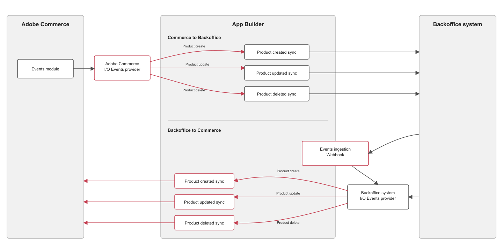

# Commerce Integration Starter Kit

[](https://github.com/adobe/commerce-integration-starter-kit/actions/workflows/deploy_node_stage.yml)

_Table of contents_:

- [**Commerce Integration Starter Kit**](#commerce--integration-starter-kit)
  - [**Prerequisites**](#prerequisites)
  - [**App Management Setup**](#app-management-setup)
  - [**Development**](#development)
  - [**Log management and forwarding**](#log-management-and-forwarding)
  - [**Integrating OpenTelemetry**](#integrating-opentelemetry)
  - [**Included actions documentation**](#included-actions-documentation)
  - [**References**](#references)

Welcome to Adobe Commerce Integration Starter Kit.

Integrating an e-commerce platform with your ERP, OMS, or CRM is a mission-critical requirement. Companies can spend tens of thousands of dollars building these integrations. To reduce the cost of integrating with Enterprise Resource Planning (ERP) solutions and to improve the reliability of real-time connections, Adobe is introducing an integration starter kit for back-office integrations using Adobe Developer App Builder. The kit includes reference integrations for commonly used commerce data like orders, products, and customers. It also includes a standardized architecture for developers to build on following best practices.

The public documentation can be found at [Adobe Developer Starter Kit docs](https://developer.adobe.com/commerce/extensibility/starter-kit/integration/).



## Prerequisites

### Install Commerce Eventing module (only required when running Adobe Commerce versions 2.4.4 or 2.4.5)

Install Adobe I/O Events for Adobe Commerce module in your commerce instance following this [documentation](https://developer.adobe.com/commerce/extensibility/events/installation/)

> [!TIP]
>
> By upgrading the Adobe I/O Events for Adobe Commerce module to version 1.6.0 or greater, you will benefit from some additional automated steps during onboarding.

## App Management Setup

This starter kit uses [App Management](https://developer.adobe.com/commerce/extensibility/app-management/) to install, configure, and deploy the application. Event subscriptions, installation, and authentication are declared in `app.commerce.config.ts` and managed by App Management, so the manual onboarding scripts are no longer needed.

To deploy the starter kit, follow the official documentation:

- [Initialize your app](https://developer.adobe.com/commerce/extensibility/app-management/initialize-app/) installs dependencies and generates the extension structure under `src/`.
- [Define your app](https://developer.adobe.com/commerce/extensibility/app-management/define-app/) explains the metadata and event subscriptions declared in `app.commerce.config.ts`.
- [Build and deploy](https://developer.adobe.com/commerce/extensibility/app-management/build-deploy/) generates the runtime actions and deploys the app with `aio app deploy`.

Commerce and external event subscriptions live in the `eventing` section of `app.commerce.config.ts`. To add or change an event, edit that file and redeploy. See [How to subscribe to a new event](#how-to-subscribe-to-a-new-event).

## Development

- [Project source code structure](#project-source-code-structure)
- [Different types of actions included in the starter kit](#different-types-of-actions-included-in-the-starter-kit)
- [Testing](#testing)
- [How to subscribe to a new event](#how-to-subscribe-to-a-new-event)

### Project source code structure

The starter kit provides boilerplate code for the synchronization across systems of the following entities:

- Product
- Customer
- Customer Group
- Stock
- Order
- Shipment

The synchronization is bidirectional by default: changes in Commerce are propagated to the external back-office application and the other way around.

#### `actions` folder structure

The action source lives under `src/commerce-extensibility-1/actions/`. Within the project it's importable through the `#src` alias (declared in `package.json`), so an action can reference shared code as `#src/constants` instead of a deep relative path. The `actions` folder contains:

- an `ingestion` folder containing the source code for an alternative events ingestion endpoint.

- a `webhook` folder containing the source for synchronous webhooks that could be called from Commerce.

- a folder named after each entity being synchronized (e.g. `customer`, `order`, `product`).

#### `entity` folder structure

Each `entity` folder follows a similar structure, and it contains folders named after each system being integrated, namely:

- a `commerce` folder.

  This folder contains the runtime actions responsible for handling incoming events from Commerce and synchronizing the data with the 3rd-party external system.

- an `external` folder.

  This folder contains the runtime actions responsible for handling incoming events from the 3rd-party external system and updating the data accordingly in Commerce.

#### `commerce` and `external` folders structure

The `commerce` and `external` folders follow a similar structure:

- one or more folders named after an action (e.g. `created`, `deleted`, etc.)

  Each of these folders contains the code for the runtime action responsible for handling one particular event.

- an `actions.config.yaml`.

  This file declares the runtime actions responsible for handling the events for an entity originating in a particular system.

#### Individual `action` folder structure

Each individual `action` folder contains the following files:

- an `index.js` file.

  It contains the `main` method that gets invoked when handling an event and is responsible for coordinating the different activities involved in that handling, such as validating the incoming payload, transforming the payload to the target API, and interacting with the target API.

- a `validator.js` file.

  It implements the logic to validate the incoming event payload.

  Actions in the `external` folder provide a sample implementation based on a JSON schema specified in the `schema.json` file.

- a `transformer.js` file.

  It implements the logic to transform the incoming event payload to make it suitable for the target API being called to propagate the changes.

- a `sender.js` file.

  It implements the logic to interact with the target API in order to get the changes propagated.

  The target API will be the Commerce API for actions in the `external` folder and the 3rd-party external API for actions in the `commerce` folder.

- `pre.js` and `post.js` files

  These files provide convenient extension points to introduce custom business logic before and after interacting with the target API.

#### Pass `env` params to an `action`

You can pass values from the environment to the action`params` object following:
Add your parameter to .env file:

```bash
HERE_YOUR_PARAM=any value
```

Pass the required parameters to the action by configuring them in the `src/commerce-extensibility-1/actions/{entity}/{flow}/actions.config.yaml` under `{action name} -> inputs` as follows:

```yaml
{ action name }:
  function: commerce/{action name}/index.js
  web: "no"
  runtime: nodejs:22
  inputs:
    HERE_YOUR_PARAM: $HERE_YOUR_PARAM_ENV
  annotations:
    require-adobe-auth: true
    final: true
```

This parameter should be accessible on the params object

```javascript
async function main(params) {
  params.HERE_YOUR_PARAM;
}
```

### Different types of actions included in the starter kit

- [event handler](#event-handler-action)
- [event ingestion](#event-ingestion-action)
- [synchronous webhook](#synchronous-webhook-actions)

`event handler` actions are the main type of action defined by the starter kit to implement the business logic needed to synchronize data between the different systems being integrated.

Additionally, boilerplate code and samples for `event ingestion` and `synchronous webhook` actions are provided.

#### `event handler` action

This action implements the business logic to manage an individual event notifying about a change in one
of the systems being integrated. Typically, its business logic includes an API call to propagate the changes
to the other system being integrated.

An `event handler` action is activated directly by the event provider it's registered to when a matching event is received. This registration is declared with `runtimeActions` in the `eventing` section of `app.commerce.config.ts`, which maps each event to the handler that processes it.

The response returned by an `event handler` action is expected to include a `statusCode` attribute so it properly reflects on the event registration `Debug Tracing` tab on the Adobe Developer Console.

By default, the response of the `event handler` actions is the following:

- success

  ```javascript
  // ./src/commerce-extensibility-1/actions/responses.js#actionSuccessResponse
  return {
    statusCode: 200,
    body: {
      success: true,
      message: "YOUR SUCCESS MESSAGE",
    },
  };
  ```

- failure
  ```javascript
  // ./src/commerce-extensibility-1/actions/responses.js#actionErrorResponse
  return {
    statusCode: 400, // 404, 500, etc
    body: {
      success: false,
      error: "YOUR ERROR MESSAGE",
    },
  };
  ```

#### `event ingestion` action

The source code for this action can be found at [./src/commerce-extensibility-1/actions/ingestion](./src/commerce-extensibility-1/actions/ingestion).

This runtime action is provided as an alternative approach to deliver events to the integration
if the 3rd-party back-office application cannot fulfill the [Events Publishing API](https://developer.adobe.com/events/docs/guides/api/eventsingress_api/) requirements.

Additional details can be found at this [README](src/commerce-extensibility-1/actions/ingestion/webhook/docs/README.md)

To get the URL of the webhook, run the following command:

```bash
aio runtime action get ingestion/webhook --url
```

By default, the response of the `event ingestion` actions is the following:

- success

  ```javascript
  // ./src/commerce-extensibility-1/actions/responses.js#successResponse
  return {
    statusCode: 200,
    body: {
      type: "EVENT TYPE",
      response: {
        success: true,
        message: "Event published successfully",
      },
    },
  };
  ```

- failure
  ```javascript
  // ./src/commerce-extensibility-1/actions/responses.js#errorResponse
  return {
    error: {
      statusCode: 400, // 404, 500, etc,
      body: {
        error: "YOUR ERROR MESSAGE",
      },
    },
  };
  ```

#### `synchronous webhook` actions

The source code for these actions can be found at [./src/commerce-extensibility-1/actions/webhook](./src/commerce-extensibility-1/actions/webhook).

These runtime actions are meant to expose a webhook that can be invoked synchronously from Commerce
in order to affect the behavior of a particular business flow.

The [./src/commerce-extensibility-1/actions/webhook/check-stock](./src/commerce-extensibility-1/actions/webhook/check-stock) folder provides a sample implementation
of a `synchronous webhook` action. Additional details can be found at this [README](src/commerce-extensibility-1/actions/webhook/check-stock/docs/README.md)

To get the URL of the webhook, run the following command:

```bash
aio runtime action get webhook/check-stock --url
```

By default, the response of the `synchronous webhook` actions is the following:

- success

  ```javascript
  // ./src/commerce-extensibility-1/actions/responses.js#webhookSuccessResponse
  return {
    statusCode: 200,
    body: {
      op: "success",
    },
  };
  ```

- failure
  ```javascript
  // ./src/commerce-extensibility-1/actions/responses.js#webhookSuccessResponse
  return {
    error: {
      statusCode: 200,
      body: {
        op: "exception",
      },
    },
  };
  ```

Remember, these responses are adapted to [Commerce webhook module](https://developer.adobe.com/commerce/extensibility/webhooks/); in case you want to use a different approach, you can change the response implementation in the code as you need.

### Testing

The starter kit provides unit tests for most of the runtime actions it includes. These tests live in the `./test/commerce-extensibility-1/actions` folder, mirroring the source layout under `src/`.

Tests run on [Vitest](https://vitest.dev/). Run them with `npm test`, or use `npm run test:coverage` to generate a coverage report in the `./test/test-coverage` folder.

### How to subscribe to a new event

The starter kit comes with predefined events for each entity. Sometimes, you may need to add a new event to an entity, e.g., a customer. To do this, follow the next steps:

> [!TIP]
> Before adding a new event, check [`EVENTS_SCHEMA.json`](./EVENTS_SCHEMA.json) to understand the schema structure and available fields for similar events. This will help you properly handle the event payload in your action handlers.

- Add the event to the `eventing` section of `app.commerce.config.ts`, under the provider that receives it (`commerce` for events from Commerce, `external` for events from a back-office system). Map it directly to the handler action with `runtimeActions`. For example, to handle a new Commerce customer event:
  ```typescript
  {
    name: "observer.THE_NEW_CUSTOMER_EVENT",
    label: "The new customer event",
    description: "The new customer event",
    fields: [field("id")],
    runtimeActions: ["customer-commerce/new-operation"],
  }
  ```
- In the `src/commerce-extensibility-1/actions/{entity}/{flow}` directory, add the action that will handle this event, e.g., `src/commerce-extensibility-1/actions/customer/commerce/new-operation/index.js`
- Configure the newly created handler action in the `actions.config.yaml` file inside the `{entity}/{flow}` folder, e.g.:
  ```yaml
  new-operation:
    function: new-operation/index.js
    web: "no"
    runtime: nodejs:22
    annotations:
      final: true
  ```
- Deploy the changes: `aio app deploy`

With these steps, you can consume the new event you added to the project.
If you want to change an existing event, make the changes in the same places:

- Edit the event in the `eventing` section of `app.commerce.config.ts`
- Make changes to the handler action mapped by its `runtimeActions`
- Deploy your changes

## Log management and forwarding

> [!WARNING]
> Log forwarding and OpenTelemetry logs (described one section below) are two separate ways to ship logs off Adobe I/O Runtime. If you enable both and point them at the same observability platform, your log data will be duplicated. Stick with one method for logs.

Application logs allow developers to debug an application in development as well as monitor it in production.

By default, the starter kit uses the [AIO SDK](https://github.com/adobe/aio-sdk) to store logs in Adobe I/O Runtime.
You can find additional details on this topic in [Managing Application Logs](https://developer.adobe.com/app-builder/docs/guides/application_logging/).

The application logs can alternatively be forwarded to a **customer-owned** log management solution (such as Splunk, Azure, or New Relic).
Use the comparison in [When to use Log Forwarding](https://developer.adobe.com/app-builder/docs/guides/application_logging/#when-to-use-log-forwarding)
to decide when to store logs in Adobe I/O Runtime and when to forward them to a log management platform.

If you are running your Adobe Commerce instance in the cloud, you already have a New Relic instance provisioned for you.
The [Forwarding Logs to New Relic](https://developer.adobe.com/app-builder/docs/guides/application_logging/new_relic/)
page describes the steps to set up the starter kit to forward logs to New Relic.

### Prevent secrets from leaking in logs.

The `stringParameters` in the `./src/commerce-extensibility-1/actions/utils.js` file can be used to avoid secrets leaking when logging the parameters received by a runtime action.
It will replace

- the `authorization` header value with `<hidden>`, and
- any parameters containing a term present in the `hidden` array with `<hidden>`

The default parameters to be hidden are:

```javascript
const hidden = ["secret", "token"];
```

Adjust these values to hide secrets passed as params to your runtime actions if needed.

## Integrating OpenTelemetry

> [!NOTE]
> The starter kit includes the `@adobe/aio-lib-telemetry` package by default. Find it on NPM [here](https://www.npmjs.com/package/@adobe/aio-lib-telemetry).

This package enables easy instrumentation of your actions with OpenTelemetry to collect comprehensive telemetry data:

- Traces (with distributed tracing capabilities)
- Metrics (for monitoring)
- Logs (for debugging)

See the [package usage guide](https://github.com/adobe/aio-lib-telemetry/blob/main/docs/usage.md) for more information about guides and examples for instrumenting your Adobe App Builder actions.

### Usage Example

> [!TIP]
> Check the [How To Use](https://github.com/adobe/aio-lib-telemetry/blob/main/docs/usage.md#how-to-use) section in the `@adobe/aio-lib-telemetry` usage guide for comprehensive integration instructions.

The starter kit ships with a sample implementation: the `customer/commerce` `created` action and the three commerce `upsert` actions (`customer/commerce`, `order/commerce`, and `product/commerce`) are instrumented out of the box. This example uses the telemetry configuration in `src/commerce-extensibility-1/actions/telemetry.js`.

The instrumentation is designed to be minimally invasive and won't disrupt existing functionality. However, telemetry requires explicit opt-in configuration: you must instrument each runtime action individually, configure exporters in the `telemetry.js` file, and set the `ENABLE_TELEMETRY` environment variable to `true` in each action's `inputs` section. While we've implemented this setup for the aforementioned actions, to fully enable telemetry, you need to complete your configuration in the `telemetry.js` file.

> [!IMPORTANT]
> `ENABLE_TELEMETRY` must be set to `true` in the `inputs` of **every** instrumented action (any action that uses `@adobe/aio-lib-telemetry` through `instrumentEntrypoint` or `instrument`). An instrumented action that is missing this input can behave inconsistently, so keep the flag in sync with your instrumentation.

The integration within the `customer/commerce` workflow facilitates three key signals: **traces**, **metrics**, and **logs**, while also adding automatic context propagation. This means that when a matching event triggers the instrumented `created` handler, it generates a unified trace that spans the entire execution flow.

### Local Telemetry Stack

We provide a Docker Compose configuration out of the box for running a local telemetry stack, which follows the [**Grafana** use case](https://github.com/adobe/aio-lib-telemetry/blob/main/docs/use-cases/grafana.md#), documented within the `@adobe/aio-lib-telemetry` package.

To spin up the telemetry stack, run the following command:

```bash
docker compose up
```

Once running, the stack will collect and forward telemetry signals from all your instrumented actions (such as `customer/commerce/created`) to the local telemetry infrastructure.

Check out the linked guide to learn how to set up Grafana for visualizing your telemetry data. The guide also covers how to use the included cloudflared service to tunnel telemetry data from your deployed App Builder runtime actions in the cloud back to your local environment.

## Included actions documentation

### External back-office ingestion webhook

- [Ingestion webhook](src/commerce-extensibility-1/actions/ingestion/webhook/docs/README.md)

### Product entity

#### Commerce to third party

- [Product created in commerce](src/commerce-extensibility-1/actions/product/commerce/created/docs/README.md)
- [Product updated in commerce](src/commerce-extensibility-1/actions/product/commerce/updated/docs/README.md)
- [Product deleted in commerce](src/commerce-extensibility-1/actions/product/commerce/deleted/docs/README.md)
- [Product full sync in commerce](src/commerce-extensibility-1/actions/product/commerce/full-sync/docs/README.md)

#### Third party to Commerce

- [Product created in third party](src/commerce-extensibility-1/actions/product/external/created/docs/README.md)
- [Product updated in third party](src/commerce-extensibility-1/actions/product/external/updated/docs/README.md)
- [Product deleted in third party](src/commerce-extensibility-1/actions/product/external/deleted/docs/README.md)

### Customer entity

#### Commerce to third party

- [Customer created in commerce](src/commerce-extensibility-1/actions/customer/commerce/created/docs/README.md)
- [Customer updated in commerce](src/commerce-extensibility-1/actions/customer/commerce/updated/docs/README.md)
- [Customer deleted in commerce](src/commerce-extensibility-1/actions/customer/commerce/deleted/docs/README.md)
- [Customer group updated in commerce](src/commerce-extensibility-1/actions/customer/commerce/group-updated/docs/README.md)
- [Customer group deleted in commerce](src/commerce-extensibility-1/actions/customer/commerce/group-deleted/docs/README.md)

#### Third party to Commerce

- [Customer created in third party](src/commerce-extensibility-1/actions/customer/external/created/docs/README.md)
- [Customer updated in third party](src/commerce-extensibility-1/actions/customer/external/updated/docs/README.md)
- [Customer deleted in third party](src/commerce-extensibility-1/actions/customer/external/deleted/docs/README.md)
- [Customer group created in third party](src/commerce-extensibility-1/actions/customer/external/group-created/docs/README.md)
- [Customer group updated in third party](src/commerce-extensibility-1/actions/customer/external/group-updated/docs/README.md)
- [Customer group deleted in third party](src/commerce-extensibility-1/actions/customer/external/group-deleted/docs/README.md)

### Order entity

#### Commerce to third party

- [Order created in commerce](src/commerce-extensibility-1/actions/order/commerce/created/docs/README.md)
- [Order updated in commerce](src/commerce-extensibility-1/actions/order/commerce/updated/docs/README.md)

#### Third party to Commerce

- [Order updated in third party](src/commerce-extensibility-1/actions/order/external/updated/docs/README.md)

### Stock entity

#### Commerce to third party

- [Stock updated in commerce](src/commerce-extensibility-1/actions/stock/commerce/updated/docs/README.md)

#### Third party to Commerce

- [Stock updated in third party](src/commerce-extensibility-1/actions/stock/external/updated/docs/README.md)

## References

- [Adobe Commerce Extensibility](https://developer.adobe.com/commerce/extensibility/)
- [Adobe developer console](https://developer.adobe.com/developer-console/docs/guides/)
- [Adobe App Builder](https://developer.adobe.com/app-builder/docs/overview/)
- [Adobe I/O Events](https://developer.adobe.com/events/docs/)
- [Adobe I/O Events for Adobe Commerce](https://developer.adobe.com/commerce/extensibility/events/)
- [Adobe I/O Runtime](https://developer.adobe.com/runtime/docs/)
- [Commerce Web APIs](https://developer.adobe.com/commerce/webapi/)

### Contributing

Contributions are welcomed! Read the [Contributing Guide](./.github/CONTRIBUTING.md) for more information.
