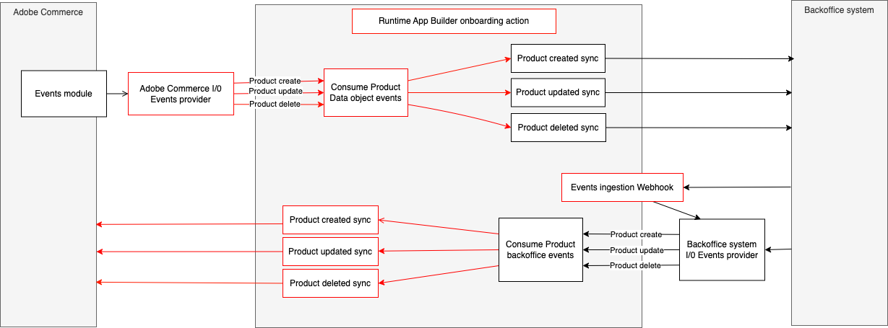

# Commerce Extensibility Starter Kit

Welcome to Adobe Commerce Extensibility Starter Kit



## Prerequisites

### Create app builder project
Go to [Adobe developer console](https://developer.adobe.com/console) portal
- Click on `Create a new project from template`
- select `App Builder`
- Chose a name and title
- Select stage workspace or create a new one
- Add the following API services (select default Oauth server to server)
  - I/0 events
  - Adobe I/O Events for Adobe Commerce
  - I/O management API
- Download [workspace configuration json](https://developer.adobe.com/commerce/extensibility/events/project-setup/#download-the-workspace-configuration-file) file and save it because you will use it to configure Adobe IO Events in commerce after.


### Configure a new Integration in commerce
Configure a new Integration to secure the calls to Commerce from App Builder using OAuth by following these steps:
- In the Commerce Admin, navigate to System > Extensions > Integrations.
- Click the `Add New Integration` button. The following screen displays
  
- Give the integration a name. The rest of the fields can be left blank.
- Select API on the left and grant access to all the resources.
  
- Click Save.
- In the list of integrations, activate your integration.
- You will need the integration details (consumer key, consumer secret, access token and access token secret) later to configure the starter kit.

### (For Adobe commerce versions 2.4.4 or 2.4.5) Install Commerce Eventing module
Install commerce eventing module in your commerce instance following this [documentation](https://developer.adobe.com/commerce/extensibility/events/installation/)

## Starter Kit first deploy & on-boarding
Following the next steps you will be able to deploy for the first time the starter kit and onboard it.
The process of on-boarding set up the needed events providers and registrations based on your selection.

### Download the project
- Download and unzip the project
- Copy the env file `cp env.dist .env`
- Fill in the values following the comments on the env file.

### Configure the project
Install the npm dependencies using the command:
```bash
npm install
```

This step will connect your starter kit project to the App builder project you created earlier.
Ensure to select the proper Organization > Project > Workspace with the following commands:
```bash
aio login
aio console org select
aio console project select
aio console workspace select
```

Sync your local application with the app builder project using the following command:
```bash
aio app use
# Choose the option 'm' (merge) 
```

Edit the file app.config.yaml in case you want to deploy specific entities by commenting the entities you don't need (e.g. `product-backoffice` if you don't need to sync product from external back-office application):
```yaml
application:
  runtimeManifest:
    packages:
      product-commerce:
        license: Apache-2.0
        actions:
          $include: ./actions/product/commerce/actions.config.yaml
    #  product-backoffice:
    #    license: Apache-2.0
    #    actions:
    #      $include: ./actions/product/external/actions.config.yaml
      customer-commerce:
        license: Apache-2.0
        actions:
          $include: ./actions/customer/commerce/actions.config.yaml
      customer-backoffice:
        license: Apache-2.0
        actions:
          $include: ./actions/customer/external/actions.config.yaml
      ...
```

### Deploy
Run the following command to deploy the entities runtimes packages, this will deploy the runtime actions needed for the onboarding step:
```bash
aio app deploy
```
You can confirm the success of the deployment in the Adobe Developer Console by selecting the runtimes option on your workspace:


### On-boarding
#### Configure the events registrations
By default, the registrations' config file is set to create all the registrations for all entities. In case you don't need a registration, you can edit the `./onboarding/custom/registrations.json` file.
In case you don't want to receive events from commerce remove `commerce` from the entity array, for backoffice updates remove `backoffice`.
e.g: In the previous step of on-boarding (`Configure the project`) we commented the product-backoffice package. In this case, we have to remove `backoffice` from `product` entity:
```json
{
  "product": ["commerce"],
  "customer": ["commerce", "backoffice"],
  "order": ["commerce", "backoffice"],
  "stock": ["commerce", "backoffice"],
  "shipment": ["commerce", "backoffice"]
}
```

#### Execute the onboarding
This step will generate the IO Events providers and the registrations for your starter kit project.
To start the process run the command:
```bash
npm run onboard
```

The console will return the providers IDs, save this information:
- You will need the commerce instance id and provider ID to configure your commerce instance later.
- You will need the backoffice provider id to send the events to the App builder project.
  e.g. of output:
```bash
Process of On-Boarding done successfully: [
  {
    key: 'commerce',
    id: 'THIS IS THE ID OF COMMERCE PROVIDER',
    instanceId: 'THIS IS THE INSTANCE ID OF COMMERCE PROVIDER',
    label: 'Commerce Provider'
  },
  {
    key: 'backoffice',
    id: 'THIS IS THE ID OF BACKOFFICE PROVIDER',
    instanceId: 'THIS IS THE INSTANCE ID OF BACKOFFICE PROVIDER',
    label: 'Backoffice Provider'
  }
]

```
Check your App developer console to confirm the creation of the registrations:


### Complete the Adobe commerce eventing configuration
You will configure your Adobe Commerce instance to send events to your App builder project using the following steps

#### Configure Adobe I/O Events in Adobe Commerce instance
To configure the provider in commerce do the following:
- In the your Adobe Commerce Admin, navigate to Stores > Settings > Configuration > Adobe Services > Adobe I/O Events > General configuration. The following screen displays.
  
- Select `OAuth (Recommended)` from the `Adobe I/O Authorization Type` menu.
- Copy the contents of the `<workspace-name>.json` (Workspace configuration json you downloaded in the previous step [`Create app builder project`](#create-app-builder-project)) into the `Adobe I/O Workspace Configuration` field.
- Copy the commerce provider instance ID you saved in the previous step [`Execute the on-boarding`](#execute-the-on-boarding) into the `Adobe Commerce Instance ID` field.
- Copy the commerce provider ID  you saved in the previous step [`Execute the on-boarding`](#execute-the-on-boarding) into the `Adobe I/O Event Provider ID` field.
- Click Save Config.
- Enable Commerce Eventing by setting `Enabled` menu to Yes. (Note: You must enable cron so that Commerce can send events to the endpoint.)
- Enter the merchant's company name in the `Merchant ID` field. You must use alphanumeric and underscores only.
- In the `Environment ID` field, enter a temporary name for your workspaces while you are in development mode. When you are ready for production, change this value to a permanent value, such as Production.
- (Optional) By default, if an error occurs when Adobe Commerce attempts to send an event to Adobe I/O, Commerce retries a maximum of seven times. To change this value, uncheck the Use system value checkbox and set a new value in the Maximum retries to send events field.
- (Optional) By default, Adobe Commerce runs a cron job (clean_event_data) every 24 hours that deletes event data that is three days old. To change the number of days to retain event data, uncheck the Use system value checkbox and set a new value in the Event retention time (in days) field.
- Click Save Config.

#### Subscribe to events in Adobe Commerce instance
You can follow the following [documentation](https://developer.adobe.com/commerce/extensibility/events/configure-commerce/#subscribe-and-register-events) to subscribe events.
Here are the events with the minimal required fields you need to subscribe to:

| Entity         | Event                                                                     | Required fields        |
|----------------|---------------------------------------------------------------------------|------------------------|
| Product        | com.adobe.commerce.observer.catalog_product_delete_commit_after           |                        |
| Product        | com.adobe.commerce.observer.catalog_product_save_commit_after             | created_at, updated_at |
| Customer       | com.adobe.commerce.observer.customer_save_commit_after                    | created_at, updated_at |
| Customer       | com.adobe.commerce.observer.customer_delete_commit_after                  |                        |
| Customer group | com.adobe.commerce.observer.customer_group_save_commit_after              |                        |
| Customer group | com.adobe.commerce.observer.customer_group_delete_commit_after            | customer_group_code    |
| Order          | com.adobe.commerce.observer.sales_order_save_commit_after                 | created_at, updated_at |
| Stock          | com.adobe.commerce.observer.cataloginventory_stock_item_save_commit_after |                        |

## Development
### External back-office ingestion webhook
- [Ingestion webhook consumer](actions/ingestion/README.md)

### Product entity
#### Commerce to third party
- [Product created in commerce](actions/product/commerce/created/README.md)
- [Product updated in commerce](actions/product/commerce/updated/README.md)
- [Product deleted in commerce](actions/product/commerce/deleted/README.md)

#### Third party to Commerce
- [Product created in third party](actions/product/external/created/README.md)
- [Product updated in third party](actions/product/external/updated/README.md)
- [Product deleted in third party](actions/product/external/deleted/README.md)

### Customer entity
#### Commerce to third party
- [Customer created in commerce](actions/customer/commerce/created/README.md)
- [Customer updated in commerce](actions/customer/commerce/updated/README.md)
- [Customer deleted in commerce](actions/customer/commerce/deleted/README.md)
- [Customer group updated in commerce](actions/customer/commerce/group-updated/README.md)
- [Customer group deleted in commerce](actions/customer/commerce/group-deleted/README.md)

#### Third party to Commerce
- [Customer created in third party](actions/customer/external/created/README.md)
- [Customer updated in third party](actions/customer/external/updated/README.md)
- [Customer deleted in third party](actions/customer/external/deleted/README.md)
- [Customer group created in third party](actions/customer/external/group-created/README.md)
- [Customer group updated in third party](actions/customer/external/group-updated/README.md)
- [Customer group deleted in third party](actions/customer/external/group-deleted/README.md)
- 
### Order entity
#### Commerce to third party
- [Order created in commerce](actions/order/commerce/created/README.md)
- [Order updated in commerce](actions/order/commerce/updated/README.md)

#### Third party to Commerce
- [Order updated in third party](actions/order/external/updated/README.md)

### Stock entity
#### Commerce to third party
- [Stock updated in commerce](actions/stock/commerce/updated/README.md)

#### Third party to Commerce
- [Stock updated in third party](actions/stock/external/updated/README.md)
