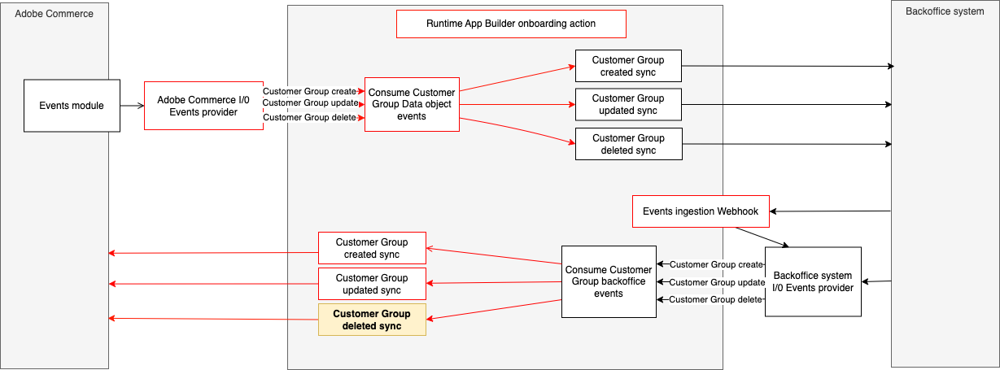

# Integrate a third-party customer group deleted event with Adobe Commerce.

This runtime action is responsible for notifying the integration with Adobe Commerce after a customer is deleted by the 3rd party.



# Incoming event payload

The incoming event payload depends on the third party API and entity model.
Here is a payload example of the data received in the event:

```json
{
  "id": 8
}
```

# Data validation

The incoming data is validated against a JSON schema defined in the `schema.json` file.
Here's an example:

```json
{
  "type": "object",
  "properties": {
    "id": { "type": "number" }
  },
  "required": ["sku"],
  "additionalProperties": false
}
```

## Interact with the Adobe Commerce API

The `sendData` function in the `sender.js` file defines the interaction with the Adobe Commerce API.
This function delegates to the `deleteCustomerGroup` method in the `actions/customer/commerce-customer-group-api-client.js` interaction with the Commerce API.
Any parameters needed from the execution environment could be accessed from `params`.
These parameters can be passed on the action by configuring them in the `actions/customer/external/actions.config.yaml` under `group-deleted -> inputs` as follows:

```yaml
group-deleted:
  function: deleted/index.js
  web: "no"
  runtime: nodejs:22
  inputs:
    LOG_LEVEL: debug
    COMMERCE_BASE_URL: $COMMERCE_BASE_URL
    COMMERCE_CONSUMER_KEY: $COMMERCE_CONSUMER_KEY
    COMMERCE_CONSUMER_SECRET: $COMMERCE_CONSUMER_SECRET
    COMMERCE_ACCESS_TOKEN: $COMMERCE_ACCESS_TOKEN
    COMMERCE_ACCESS_TOKEN_SECRET: $COMMERCE_ACCESS_TOKEN_SECRET
  annotations:
    require-adobe-auth: true
    final: true
```
