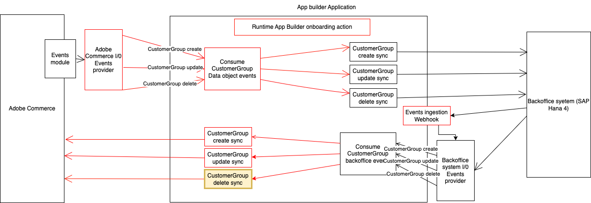

# Integrate a third party customer group deleted event with Adobe Commerce.
This runtime action is responsible for notifying the integration with Adobe Commerce after a customer is deleted in the 3rd party.



# Incoming information
The incoming data depends on the third party API and entity model.
Here is a JSON sample:
```json
{
  "id": 8
}
```

# Data validation
The incoming data is validated against a JSON schema defined in the `schema.json` file.
Here's an example:
```json
{
  "type": "object",
  "properties": {
    "id": { "type": "number" }
  },
  "required": ["sku"],
  "additionalProperties": false
}

```

## Payload transformation
Please proceed with any data transformation needed to adapt the incoming message to the Adobe Commerce API payload.
That transformation is defined in the `transformData` function in the `transformer.js` file.

## Preprocess data
Any preprocessing needed before calling the Adobe Commerce API can be implemented in the `preProcess` function in the `pre.js` file.

## Interact with the Adobe Commerce API
The interaction with the Adobe Commerce API is defined in the `sendData` function in the `sender.js` file.
This function delegates to the `deleteCustomerGroup` method in the `actions/customer/commerceCustomerGroupApiClient.js` the interaction with the Commerce API.
Any parameters needed from the execution environment could be access from `params`. 
These parameters can be passed on the action by configuring them in the  `actions/customer/external/actions.config.yaml` under `group-deleted -> inputs` as follows:
```yaml
group-deleted:
  function: deleted/index.js
  web: 'no'
  runtime: nodejs:16
  inputs:
    LOG_LEVEL: debug
    COMMERCE_BASE_URL: $COMMERCE_BASE_URL
    COMMERCE_CONSUMER_KEY: $COMMERCE_CONSUMER_KEY
    COMMERCE_CONSUMER_SECRET: $COMMERCE_CONSUMER_SECRET
    COMMERCE_ACCESS_TOKEN: $COMMERCE_ACCESS_TOKEN
    COMMERCE_ACCESS_TOKEN_SECRET: $COMMERCE_ACCESS_TOKEN_SECRET
  annotations:
    require-adobe-auth: true
    final: true
```

## Postprocess data
Any postprocessing needed after calling the Adobe Commerce API can be implemented in the `postProcess` function in the `post.js` file.

# Response expected
The runtime action must respond 400 if the validation fails. It will prevent the message processing from being retried by Adobe I/O.
```javascript
return {
    statusCode: 400,
    error: errors
}
```

The runtime action must respond 500 in case of an unexpected error while processing the request. Please send an array of errors so the consumer can log it and trigger the retry mechanism.
```javascript
return {
    statusCode: 500,
    error: errors
}
```

In case that everything is fine, return 200 to mark the event completed in Adobe I/O and close the loop.
```javascript
return {
    statusCode: 200
}
```

