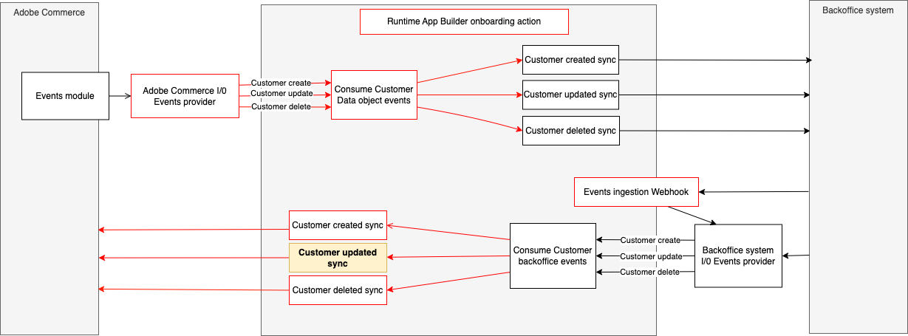

# Integrate a third party customer-updated event with Adobe Commerce.

This runtime action is responsible for notifying the integration with Adobe Commerce after a customer is updated in the 3rd party.



# Incoming event payload

The incoming event payload depends on the third party API and entity model.
Here is a payload example of the data received in the event:

```json
{
  "id": 1234,
  "email": "sample@email.com",
  "name": "John",
  "lastname": "Doe"
}
```

# Data validation

The incoming data is validated against a JSON schema defined in the `schema.json` file.
Here's an example:

```json
{
  "type": "object",
  "properties": {
    "id": { "type": "number" },
    "name": { "type": "string" },
    "lastname": { "type": "string" },
    "email": { "type": "string" }
  },
  "required": ["id", "name", "lastname", "email"],
  "additionalProperties": true
}
```

## Interact with the Adobe Commerce API

The `sendData` function in the `sender.js` file defines the interaction with the Adobe Commerce API.
This function delegates to the `updateCustomer` method in the `actions/customer/commerce-customer-api-client.js` the interaction with the Commerce API.
Any parameters needed from the execution environment could be accessed from `params`.
These parameters can be passed on the action by configuring them in the `actions/customer/external/actions.config.yaml` under `updated -> inputs` as follows:

```yaml
updated:
  function: updated/index.js
  web: "no"
  runtime: nodejs:22
  inputs:
    LOG_LEVEL: debug
    COMMERCE_BASE_URL: $COMMERCE_BASE_URL
    COMMERCE_CONSUMER_KEY: $COMMERCE_CONSUMER_KEY
    COMMERCE_CONSUMER_SECRET: $COMMERCE_CONSUMER_SECRET
    COMMERCE_ACCESS_TOKEN: $COMMERCE_ACCESS_TOKEN
    COMMERCE_ACCESS_TOKEN_SECRET: $COMMERCE_ACCESS_TOKEN_SECRET
  annotations:
    require-adobe-auth: true
    final: true
```
