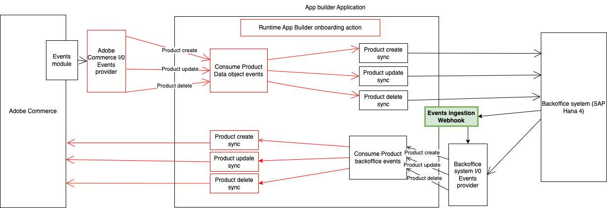

# Publish external back-office events through ingestion webhook.

It is an alternative method to deliver events for scenarios where the calling system cannot produce a request to interact directly with the event provider, such as:
- The client cannot add custom headers to the request

This runtime action is responsible for exposing a web entry point to external backoffice application for publishing information to IO events.

**To activate this feature**, remove the comment '#' from the line `#$include: ./ingestion/actions.config.yaml` in the file `app.config.yaml`.



# Incoming information
The ingestion webhook supports bulk operations. data parameters hold the array of events to publish, each event must include entity, event, and value. value parameter holds the data to send through the event.
- The entities available are: [product, customer, customer-group, order, shipment, stock]
- The list of available events by entity could be found on the file `onboarding/config/events.json` under `backoffice` sections.

Here is the payload JSON sample:
```json
{
  "data": [
    {
      "uid": "event_uid_1",
      "event": "be-observer.catalog_product_create",
      "value": {
        "sku": "PRODUCT_SKU",
        "name": "Product SKU",
        "price": 1,
        "description": "Product SKU description"
      }
    },
    {
      "uid": "event_uid_2",
      "event": "be-observer.catalog_product_create",
      "value": {
        "sku": "PRODUCT_SKU_2",
        "name": "Product SKU 2",
        "price": 1,
        "description": "Product SKU description 2"
      }
    }
  ]
}
```

## Authentication
The webhook is not authenticated by default, you must implement your authentication check on the file `ingestion/auth.js` method checkAuthentication(params).

## Use extra env parameters
Any need for parameters from environment could be accessed from `params`. Add the needed parameter in the `actions/ingestion/webhook/actions.config.yaml` under `webhook -> inputs` as follows:
```yaml
webhook:
  function: ./consumer/index.js
  web: 'no'
  runtime: nodejs:16
  inputs:
    LOG_LEVEL: debug
    OAUTH_ORG_ID: $OAUTH_ORG_ID
    OAUTH_CLIENT_ID: $OAUTH_CLIENT_ID
    OAUTH_CLIENT_SECRET: $OAUTH_CLIENT_SECRET
    OAUTH_TECHNICAL_ACCOUNT_ID: $OAUTH_TECHNICAL_ACCOUNT_ID
    OAUTH_TECHNICAL_ACCOUNT_EMAIL: $OAUTH_TECHNICAL_ACCOUNT_EMAIL
    IO_MANAGEMENT_BASE_URL: $IO_MANAGEMENT_BASE_URL
    IO_CONSUMER_ID: $IO_CONSUMER_ID
    IO_PROJECT_ID: $IO_PROJECT_ID
    IO_WORKSPACE_ID: $IO_WORKSPACE_ID
    AIO_runtime_namespace: $AIO_runtime_namespace
    
    HERE_YOUR_PARAM: $HERE_YOUR_PARAM_ENV
    
  annotations:
    require-adobe-auth: false
    final: true
```

# Response expected
the runtime action returns the following response in case of error:
```javascript
return {
  error: {
    statusCode: '5XX or 4XX',
    body: {
      error: 'Error message'
    }
  }
}

```
In case that everything is fine, it returns 200 status code, success status, request data and events sent.
Each event in the response include a success field to indicate if the event was delivered ot IO Events or not.
This response indicate only the delivery success of the events not the result of execution of these events.

```javascript
return {
  statusCode: 200,
  body: {
    success: true,
    events: [
        {
          "data": {
            "description": "Test",
            "name": "Test",
            "price": 1,
            "sku": "TEST"
          },
          "providerId": "provider id",
          "providerName": "Backoffice Provider",
          "success": "OK",
          "type": "be-observer.catalog_product_create"
        }
      ]
  }
}
```
