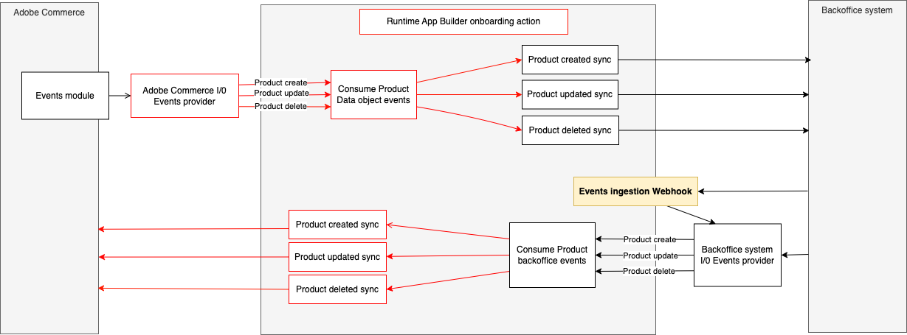

# Publish external back-office events through ingestion webhook.

It is an alternative method to deliver events for scenarios where the calling system cannot produce a request to interact directly with the event provider, such as:

- The client cannot add custom headers to the request

This runtime action exposes a web entry point to an external back office application for publishing information to IO events.

**This feature is turned off by default. To activate it**, remove the comment '#' from the line `#$include ./ingestion/actions.config.yaml` in the file `app.config.yaml`.



# Input information

Data parameters hold the event information to publish; each event must include entity, event, and value. The value parameter contains the data to send through the event.

- The entities available are [product, customer, customer-group, order, shipment, stock]
- The list of events available by an entity can be found in the file `onboarding/config/events.json` under the `backoffice` sections.

Here is the payload JSON sample:

```json
{
  "data": {
    "uid": "event_uid_1",
    "event": "be-observer.catalog_product_create",
    "value": {
      "sku": "PRODUCT_SKU",
      "name": "Product SKU",
      "price": 1,
      "description": "Product SKU description"
    }
  }
}
```

## Authentication

The webhook is not authenticated by default; you must implement your authentication check on the file `ingestion/auth.js` method checkAuthentication(params).

## Use extra env parameters

You can access any needed environment parameter from `params`. Add the required parameter in the `actions/ingestion/webhook/actions.config.yaml` under `webhook -> inputs` as follows:

```yaml
webhook:
  function: ./consumer/index.js
  web: "no"
  runtime: nodejs:22
  inputs:
    LOG_LEVEL: debug
    OAUTH_ORG_ID: $OAUTH_ORG_ID
    OAUTH_CLIENT_ID: $OAUTH_CLIENT_ID
    OAUTH_CLIENT_SECRET: $OAUTH_CLIENT_SECRET
    OAUTH_TECHNICAL_ACCOUNT_ID: $OAUTH_TECHNICAL_ACCOUNT_ID
    OAUTH_TECHNICAL_ACCOUNT_EMAIL: $OAUTH_TECHNICAL_ACCOUNT_EMAIL
    IO_MANAGEMENT_BASE_URL: $IO_MANAGEMENT_BASE_URL
    IO_CONSUMER_ID: $IO_CONSUMER_ID
    IO_PROJECT_ID: $IO_PROJECT_ID
    IO_WORKSPACE_ID: $IO_WORKSPACE_ID
    AIO_runtime_namespace: $AIO_runtime_namespace

    HERE_YOUR_PARAM: $HERE_YOUR_PARAM_ENV

  annotations:
    require-adobe-auth: false
    final: true
```
