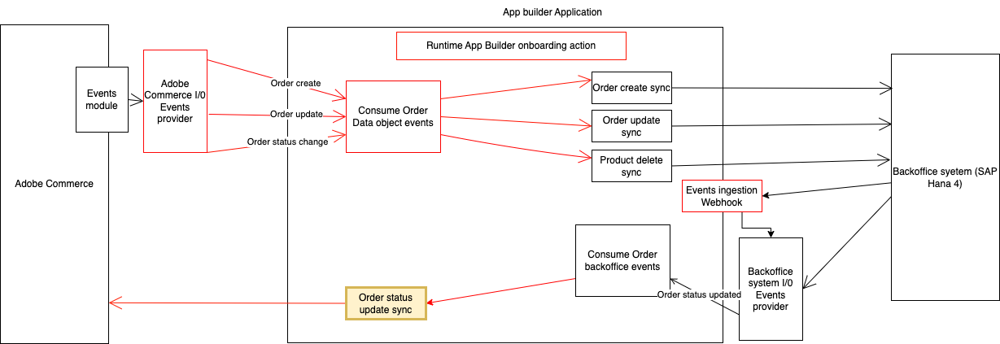

# Integrate a third party order status updated event with Adobe Commerce.

This runtime action is responsible for notifying the integration with Adobe Commerce after an order status is updated in the 3rd party.
As a result of processing this event a comment will be added to the related order.



# Incoming event payload

The incoming event payload depends on the third party API and entity model.
Here is a payload example of the data received in the event:

```json
{
  "id": 99,
  "status": "shipped",
  "notifyCustomer": false
}
```

# Data validation

The incoming data is validated against a JSON schema defined in the `schema.json` file.
Here's an example:

```json
{
  "type": "object",
  "properties": {
    "id": { "type": "integer" },
    "status": { "type": "string" },
    "notifyCustomer": { "type": "boolean" }
  },
  "required": ["id", "status"],
  "additionalProperties": true
}
```

## Interact with the Adobe Commerce API

The `sendData` function in the `sender.js` file defines the interaction with the Adobe Commerce API.
This function delegates to the `addComment` method in the `actions/order/commerce-order-api-client.js` the interaction with the Commerce API.
Any parameters needed from the execution environment could be accessed from `params`.
These parameters can be passed on the action by configuring them in the `actions/order/external/actions.config.yaml` under `updated -> inputs` as follows:

```yaml
updated:
  function: updated/index.js
  web: "no"
  runtime: nodejs:22
  inputs:
    LOG_LEVEL: debug
    AIO_COMMERCE_API_BASE_URL: $AIO_COMMERCE_API_BASE_URL
    AIO_COMMERCE_AUTH_INTEGRATION_CONSUMER_KEY: $AIO_COMMERCE_AUTH_INTEGRATION_CONSUMER_KEY
    AIO_COMMERCE_AUTH_INTEGRATION_CONSUMER_SECRET: $AIO_COMMERCE_AUTH_INTEGRATION_CONSUMER_SECRET
    AIO_COMMERCE_AUTH_INTEGRATION_ACCESS_TOKEN: $AIO_COMMERCE_AUTH_INTEGRATION_ACCESS_TOKEN
    AIO_COMMERCE_AUTH_INTEGRATION_ACCESS_TOKEN_SECRET: $AIO_COMMERCE_AUTH_INTEGRATION_ACCESS_TOKEN_SECRET
  annotations:
    require-adobe-auth: true
    final: true
```
