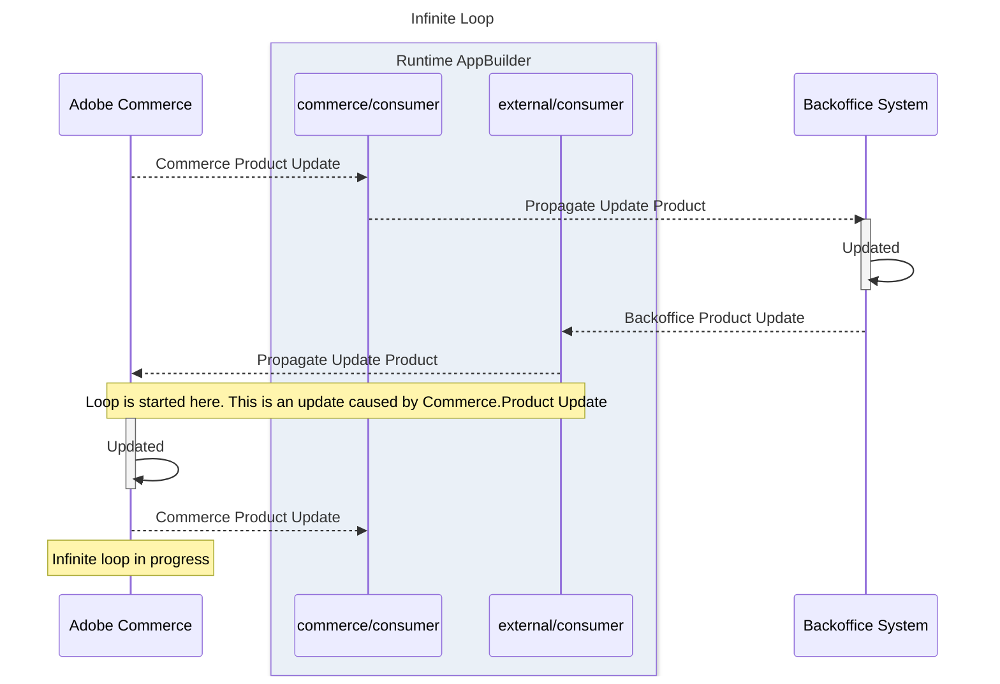
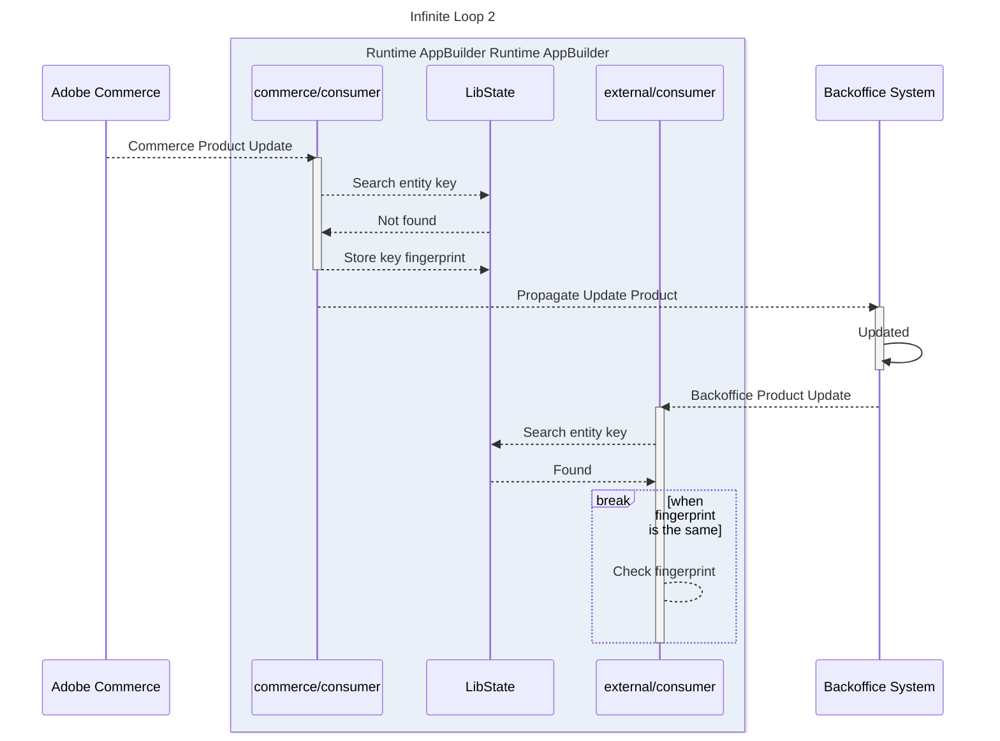

# Consumer action with Infinite Loop Breaker

## Infinite Loop Breaker

This action implements an Infinite Loop Breaker for Adobe Commerce product events with a third party backoffice.

An Infinite Loop occurs when an entity is updated in Adobe Commerce, this update is propagated to a 3rd party backoffice,
which send a new event about the update. This event is again propagated to Adobe Commerce, where the process starts again



## How to avoid the infinite loop

To avoid the infinite loop, we should track which changes in a product entity have caused a product update event. To do this:

1. Define a key for identifying an entity.
2. Define a fingerprint to check when there is a change in an entity.
3. When an update for an entity arrives at our app, calculate the key and the fingerprint
4. We check if we have tracked this entity check, by searching the key in our app.
   1. If the key does not exists we propagate the update
   2. If the key exists, compare the received fingerprint with the stored one.
      1. If fingerprints are the same --> discard the event, as it has already been processed
      2. If different propagate the event.





## Implementation example

Implementation uses ```@adobe/aio-lib-state``` to maintain events that have been received in the AppBuilder app.

```javascript

// Import lib-state and infinite loop breaker
const stateLib = require('@adobe/aio-lib-state')
const { storeFingerPrint, isAPotentialInfiniteLoop } = require('../../../infinite-loop-breaker')

```

The consumer add the list of events we want to avoid infinite loops.

```javascript

 // Detect infinite loop and break it
    const infiniteLoopEventTypes = [
      'com.adobe.commerce.observer.catalog_product_save_commit_after',
      'com.adobe.commerce.observer.catalog_product_delete_commit_after'
    ]
```

Define two functions:
1. fnInfiniteLoopKey: Define a function to generate a key to identify that the event its related to an entity.

2. fnFingerprint: Define a function to generate an object that would be used as fingerprint. It should includes data that may change.

```javascript
  /**
   * This function generates a function to genereate fingerprint for the data to be
   * used in infinite loop detection based on params.
   * @param {object} params Data received from the event
   * @returns {Function} the function that generates the fingerprint
   */
  function fnFingerprint (params) {
    return () => { return { product: params.data.value.sku, description: params.data.value.description } }
  }

  /**
   * This function generates a function to create a key for the infinite loop
   * detection based on params.
   * @param {object} params Data received from the event
   * @returns {Function} the function that generates the keu
   */
  function fnInfiniteLoopKey (params) {
    return () => { return `ilk_${params.data.value.sku}` }
  }

```

Check for infinite loop this way.

```javascript

    const infiniteLoopData = {
      fingerprintFn: fnFingerprint(params),
      keyFn: fnInfiniteLoopKey(params),
      event: params.type,
      eventTypes: infiniteLoopEventTypes
    }

    if (await isAPotentialInfiniteLoop(state, infiniteLoopData)) {
      ...
    }
```

If the event is processed, store the finger print

```javascript
await storeFingerPrint(state, fnInfiniteLoopKey(params), fnFingerprint(params))
```

Fingerprints have a default TTL of 60s seconds.

Infinite loops can be initiated from commerce updates or third party updates. So this mechanism should be implemented in both agents receiving updates.