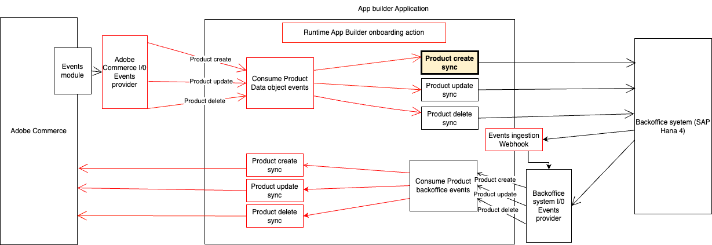

# Integrate Adobe Commerce product-created event with a third party.
This runtime action is responsible for notifying the integration with the 3rd party after a product is created in Adobe Commerce.



# Incoming information
The incoming depends on the fields specified during the event registration in Adobe Commerce. For more information, please check it here: https://developer.adobe.com/commerce/extensibility/events/configure-commerce/#subscribe-and-register-events
Here is JSON sample information:
```json
{
   "created_at":"2023-11-24 16:52:40",
   "name":"Test product name",
   "sku":"2_4_7_TestProduct",
   "updated_at":"2023-11-29 16:48:55"
}
```
There is other interesting information that you can access in params, like the event code triggered by Commerce and event ID.

## Payload transformation
Please proceed with any data transformation required for the information required format in the 3rd party in the extension module.
That transformation is defined in the `transformData` function in the `transformer.js` file.

## Connect with the 3rd party
The connection with the third party is defined in the `sendData` function in the `sender.js` file.
Please include all the authentication and connection login on that `sender.js` file or an extracted file outside index.js.
Any need for parameters from environment could be access from `params`. Add the needed parameter in the `actions/product/commerce/actions.config.yaml` under `commerce-created -> inputs` as follows:
```yaml
commerce-created:
  function: commerce/created/index.js
  web: 'no'
  runtime: nodejs:16
  inputs:
    LOG_LEVEL: debug
    HERE_YOUR_PARAM: $HERE_YOUR_PARAM_ENV
  annotations:
    require-adobe-auth: true
    final: true
```

# Response expected
That runtime action must respond 500 in case of error with the 3rd party integration. Please send an array of errors so the consumer can log it and trigger the retry mechanism.
```javascript
return {
    statusCode: 500,
    error: errors
}

```
In case that everything is fine, return 200 to mark the event completed in Adobe I/O and close the loop.
```javascript
return {
    statusCode: 200
}
```

