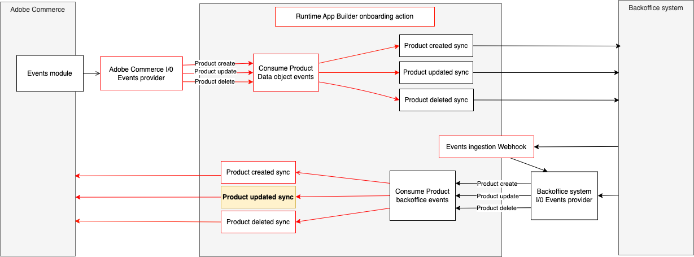

# Integrate a third party product-updated event with Adobe Commerce.
This runtime action is responsible for notifying the integration with Adobe Commerce after a product is updated in the 3rd party.



# Incoming event payload
The incoming event payload depends on the third party API and entity model.
Here is a payload example of the data received in the event:
```json
{
  "sku": "b7757d8a-3f3a-4ffd-932a-28cb07debef6",
  "name": "A Product Name",
  "price": 99.99,
  "description": "A product description"
}
```

# Data validation
The incoming data is validated against a JSON schema defined in the `schema.json` file.
Here's an example:
```json
{
  "type": "object",
  "properties": {
    "sku": { "type": "string" },
    "name": { "type": "string" },
    "price": {"type":  "number"},
    "description": {"type":  "string"}
  },
  "required": ["sku", "name", "price", "description"],
  "additionalProperties": true
}
```

## Interact with the Adobe Commerce API
The `sendData` function in the `sender.js` file defines the interaction with the Adobe Commerce API.
This function delegates to the `updateProduct` method in the `actions/product/commerce-product-api-client.js` the interaction with the Commerce API.
Any parameters needed from the execution environment could be accessed from `params`.
These parameters can be passed on the action by configuring them in the  `actions/product/external/actions.config.yaml` under `updated -> inputs` as follows:
```yaml
updated:
  function: updated/index.js
  web: 'no'
  runtime: nodejs:16
  inputs:
    LOG_LEVEL: debug
    COMMERCE_BASE_URL: $COMMERCE_BASE_URL
    COMMERCE_CONSUMER_KEY: $COMMERCE_CONSUMER_KEY
    COMMERCE_CONSUMER_SECRET: $COMMERCE_CONSUMER_SECRET
    COMMERCE_ACCESS_TOKEN: $COMMERCE_ACCESS_TOKEN
    COMMERCE_ACCESS_TOKEN_SECRET: $COMMERCE_ACCESS_TOKEN_SECRET
  annotations:
    require-adobe-auth: true
    final: true
```
