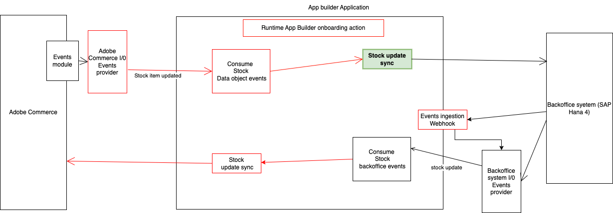

## Integrate Adobe Commerce stock item updated event with a third party

This runtime action is responsible for notifying the integration with the 3rd party after a stock item is updated in Adobe Commerce.



# Incoming event payload

The incoming event payload depends on the fields specified during the event registration in Adobe Commerce. For more information, please check it here: https://developer.adobe.com/commerce/extensibility/events/configure-commerce/#subscribe-and-register-events.
Here is a payload example of the data received in the event:

```json
{
  "item_id": "1",
  "product_id": "1",
  "stock_id": 1,
  "qty": "1",
  "min_qty": "0",
  "is_qty_decimal": "0",
  "max_sale_qty": "10000",
  "is_in_stock": "1",
  "website_id": 0,
  "type_id": "simple"
}
```

There is other interesting information that you can access from `params`, like the event type and event ID.

## Connect with the 3rd party

The `sendData` function in the `sender.js` file defines the connection with the third party.
Please include all the authentication and connection login on that `sender.js` file or an extracted file outside `index.js`.
Any values from the environment could be accessed from `params`. Pass the required parameters by the action by configuring them in the `actions/stock/commerce/actions.config.yaml` under `updated -> inputs` as follows:

```yaml
updated:
  function: commerce/updated/index.js
  web: "no"
  runtime: nodejs:22
  inputs:
    LOG_LEVEL: debug
    HERE_YOUR_PARAM: $HERE_YOUR_PARAM_ENV
  annotations:
    require-adobe-auth: true
    final: true
```
