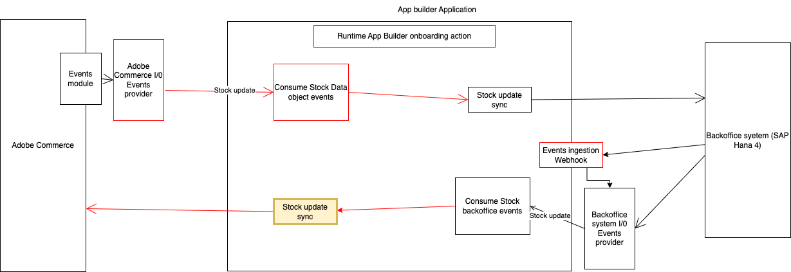

# Integrate a third-party stock updated event with Adobe Commerce.

This runtime action is responsible for notifying the integration with Adobe Commerce after a customer is updated in the 3rd party.



# Incoming event payload

The incoming event payload depends on the third party API and entity model.
Here is a payload example of the data received in the event:

```json
{
  "sourceItems": [
    {
      "sku": "sku-one",
      "source": "source-one",
      "quantity": 0,
      "outOfStock": true
    },
    {
      "sku": "sku-two",
      "source": "source-two",
      "quantity": 66,
      "outOfStock": false
    }
  ]
}
```

# Data validation

The incoming data is validated against a JSON schema defined in the `schema.json` file.
Here's an example:

```json
{
  "type": "array",
  "items": {
    "properties": {
      "sku": { "type": "string" },
      "source": { "type": "string" },
      "quantity": { "type": "number" },
      "outOfStock": { "type": "boolean" }
    },
    "required": ["sku", "source", "quantity", "outOfStock"],
    "additionalProperties": true
  }
}
```

## Interact with the Adobe Commerce API

The `sendData` function in the `sender.js` file defines the interaction with the Adobe Commerce API.
This function delegates to the `updateStock` method in the `actions/stock/commerce-stock-api-client.js` the interaction with the Commerce API.
Any parameters needed from the execution environment could be accessed from `params`.
These parameters can be passed on the action by configuring them in the `actions/stock/external/actions.config.yaml` under `updated -> inputs` as follows:

```yaml
updated:
  function: updated/index.js
  web: "no"
  runtime: nodejs:22
  inputs:
    LOG_LEVEL: debug
    COMMERCE_BASE_URL: $COMMERCE_BASE_URL
    COMMERCE_CONSUMER_KEY: $COMMERCE_CONSUMER_KEY
    COMMERCE_CONSUMER_SECRET: $COMMERCE_CONSUMER_SECRET
    COMMERCE_ACCESS_TOKEN: $COMMERCE_ACCESS_TOKEN
    COMMERCE_ACCESS_TOKEN_SECRET: $COMMERCE_ACCESS_TOKEN_SECRET
  annotations:
    require-adobe-auth: true
    final: true
```
