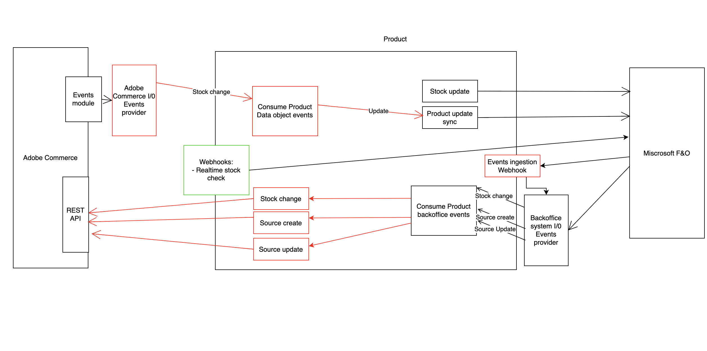

# Real-time stock check webhook.

This runtime action exposes a web entry point to check the available stock for commerce cart items in real time. You must implement the logic to check the stock on the external service.
The response of this runtime is adapted for [Commerce webhook module](https://developer.adobe.com/commerce/extensibility/webhooks/) to allow intercepting flows in Adobe commerce.



# Input information

Here is the payload JSON example:
```json
{
  "data": {
    "cart_id": "cart id",
    "items": [
      {
        "item_id": 1,
        "sku": "Product SKU",
        "qty": "Cart item qty"
      }
    ]
  }
}
```

## Validation
The parameters (data, data.cart_id, and data.items) are required. The validation logic is found on the file `webhook\check-stock\validator.js`. If needed, you can add more validations to the `validateData` method in this file.

## Check available stock
This runtime uses the method checkAvailableStock() in the file `webhook\check-stock\stock.js`. You must implement the method's logic to check the stock availability for the items received in `params`.
The method should return the following in the case of:

**Items stock available:**
```javascript
return {
  success: false
}
```

**Items stock not available:**
```javascript
return {
  success: false,
  message: 'Some custom error like stock not available for items.'
}
```

## Use extra env parameters
You can access any needed environment parameter from `params`. Add the required parameter in the `actions/webhook/check-stock/actions.config.yaml` under `check-stock -> inputs` as follows:
```yaml
check-stock:
  function: check-stock/index.js
  web: 'yes'
  runtime: nodejs:16
  inputs:
    LOG_LEVEL: debug
    
    HERE_YOUR_PARAM: $HERE_YOUR_PARAM_ENV
    
  annotations:
    require-adobe-auth: false
    final: true
```

# Response expected
the runtime action returns the following response in case of error:
```javascript
return {   
  statusCode: '200',
  body: {
    op: 'exception',
    message: 'Error message'
  }
}
```
If everything is fine, it returns the flowing response:

```javascript
return {
  statusCode: '200',
  body: {
    op: 'success'
  }
}
```

Remember, these responses are adapted to [Commerce webhook module](https://developer.adobe.com/commerce/extensibility/webhooks/); in case you want to use a different approach, you can change the response implementation in the code as you need.
