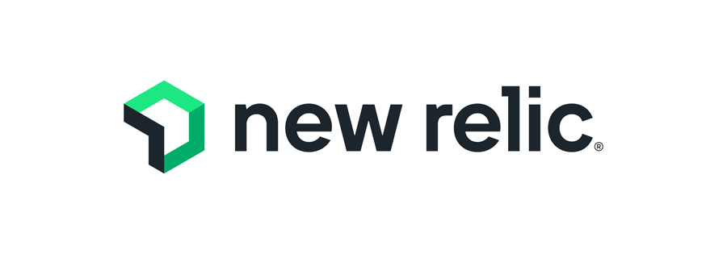
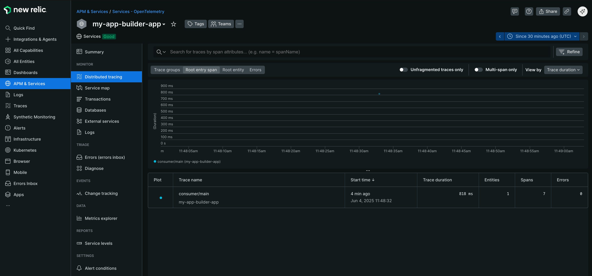
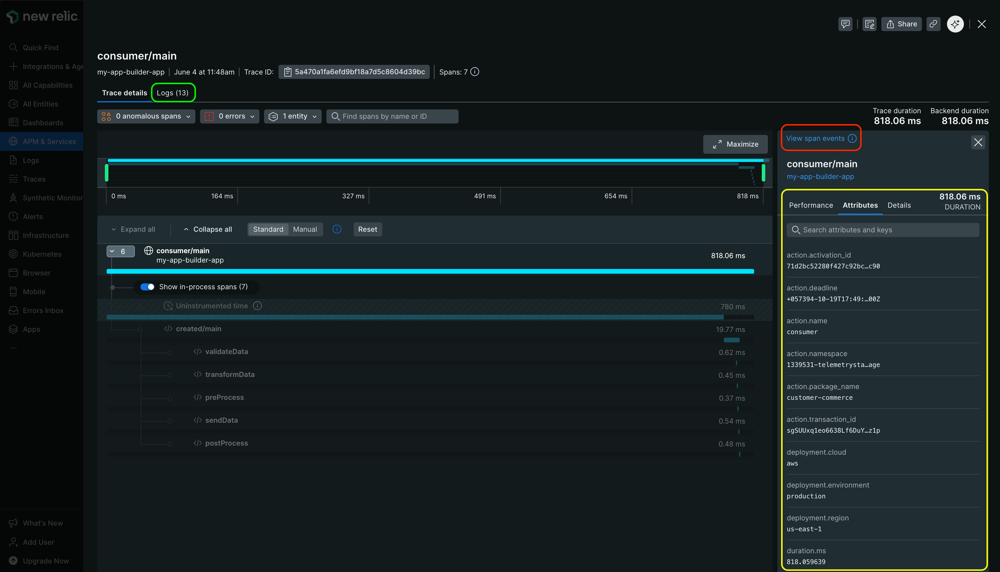

# OpenTelemetry Instrumentation with New Relic

<br />
<div align="center">
  
</div>
<br />

This guide demonstrates how to configure runtime actions to send telemetry signals directly to New Relic. Since we'll send signals without an OpenTelemetry Collector intermediary, this approach works seamlessly in both **development** (`aio app dev`) and **production** (`aio app deploy`) environments.

- [OpenTelemetry Instrumentation with New Relic](#opentelemetry-instrumentation-with-new-relic)
  - [Prerequisites](#prerequisites)
  - [Setup](#setup)
    - [Configuration](#configuration)
    - [How to Use](#how-to-use)
  - [Visualize the Data](#visualize-the-data)
    - [Traces](#traces)
    - [Metrics](#metrics)
    - [Logs](#logs)

## Prerequisites

- A [New Relic](https://newrelic.com/) account with a [license key](https://docs.newrelic.com/docs/apis/intro-apis/new-relic-api-keys/).
- An App Builder project with OpenTelemetry instrumentation.

## Setup

In order for our runtime actions to send telemetry signals to New Relic, we need to configure our telemetry exporters to send them to the [OTLP ingestion endpoint](https://docs.newrelic.com/docs/opentelemetry/best-practices/opentelemetry-otlp/) provided by the platform. 

> [!NOTE]
> The OTLP endpoint URL varies based on your New Relic account's region. Additionally, New Relic requires or recommends specific configuration parameters for optimal signal ingestion. 
> 
> For detailed configuration requirements, refer to the "**Config**" sections in the OTLP ingestion endpoint documentation linked above. The below configuration will not set any of those parameters, as it's intended to be a starting point for your own configuration.

### Configuration

#### Environment Variables

Go to New Relic's [API Keys page](https://one.eu.newrelic.com/admin-portal/api-keys/home) and create/retrieve an ingestion **license** key. Copy that key and set it as an environment variable in your `.env` file. Make sure you're also declaring that same variable as an input in your runtime actions configuration file (`app.config.yaml`).

Assuming your environment variable is called `NEW_RELIC_LICENSE_KEY`:

```yaml
my-action:
  function: path/to/my-action.js
  inputs:
    LOG_LEVEL: debug
    NEW_RELIC_LICENSE_KEY: $NEW_RELIC_LICENSE_KEY

  # ...other configuration options
```

#### SDK Configuration

This configuration uses the HTTP/Protobuf exporter, as per New Relic's [documentation recommendations](https://docs.newrelic.com/docs/opentelemetry/best-practices/opentelemetry-otlp/#configure-endpoint-port-protocol).

> [!IMPORTANT]
> If you want to use gRPC exporters, make sure you switch the imported exporters to their gRPC counterparts. Also, ensure your ingestion endpoint points to the 4317 port, which is the default port for gRPC.

```ts
// telemetry.ts

import {
  defineTelemetryConfig,
  getAioRuntimeResourceWithAttributes,
  getPresetInstrumentations
} from "@adobe/aio-lib-telemetry";

import {
  OTLPTraceExporterProto,
  OTLPLogExporterProto,
  OTLPMetricExporterProto,
  PeriodicExportingMetricReader,
  SimpleLogRecordProcessor
} from "@adobe/aio-lib-telemetry/otel-api";

// Choose the correct endpoint for your region
// We'll be using HTTP/Protobuf protocol, which uses the 4318 port.
const NEW_RELIC_OTLP_ENDPOINT = "https://otlp.nr-data.net:4318";

function newRelicConfig(params) {
  const makeExporterConfig = (endpoint) => {
    return {
      url: `${NEW_RELIC_OTLP_ENDPOINT}/${endpoint}`,
      headers: {
        "api-key": params.NEW_RELIC_LICENSE_KEY,
      },
    }
  }

  // Use the HTTP/Protobuf exporter (recommended by New Relic docs)
  return {
    traceExporter: new OTLPTraceExporterProto(
      makeExporterConfig("v1/traces"),
    ),

    metricReader: new PeriodicExportingMetricReader({
      exporter: new OTLPMetricExporterProto(
        makeExporterConfig("v1/metrics"),
      ),
    }),

    logRecordProcessors: [
      // Or BatchLogRecordProcessor
      new SimpleLogRecordProcessor(
        new OTLPLogExporterProto(
          makeExporterConfig("v1/logs"),
        ),
      ),
    ],
  };
}

export const telemetryConfig = defineTelemetryConfig((params, isDev) => {
  const sdkConfig = {
    serviceName: "my-app-builder-app",
    instrumentations: getPresetInstrumentations("simple"),
    resource: getAioRuntimeResourceWithAttributes({
      "service.version": "1.0.0",
    }),

    ...newRelicConfig(params),
  };

  return {
    sdkConfig,
    diagnostics: {
      logLevel: isDev ? "debug" : "info",
    },
  };
});
```

### How to Use

Exporting directly to New Relic will seamlessly work in both development and production environments (no configuration changes required). Follow the [library documentation](../../README.md#-how-to-use) to instrument your runtime actions.

## Visualize the Data

Your OpenTelemetry instrumented service should appear under the [All Entities](https://one.eu.newrelic.com/nr1-core?filters=(domain%20IN%20('APM',%20'EXT')%20AND%20type%20IN%20('APPLICATION',%20'SERVICE'))) section or under the **APM & Services** menu, under a **Services - OpenTelemetry** dashboard.


Click on the service to see the [traces](#traces), [metrics](#metrics), and [logs](#logs).

### Traces

Navigate to your instrumented service's UI (`my-app-builder-app` in this example) and locate the traces under the **Monitor** section's **Distributed Tracing** tab. Below is an example trace visualization.



<p>
  Click on a trace to see its constituent spans, and also additional details, like the <a href="https://opentelemetry.io/docs/specs/otel/logs/#log-correlation">logs correlated to that trace</a> (<span style="color: lightgreen;"><b>green square</b></span>). If you click on a span, you can see the associated <a href="https://opentelemetry.io/docs/concepts/signals/traces/#span-events">span events</a> (<span style="color: red;"><b>red square</b></span>), and the <a href="https://opentelemetry.io/docs/concepts/signals/traces/#attributes">span attributes</a> (<span style="color: yellow;"><b>yellow square</b></span>).
</p>

> [!TIP]
> You can configure span attributes at two levels: globally for all signals via the `resource` property in `sdkConfig`, or individually per span using the optional `attributes` property in the `spanConfig` object passed to `instrument` function helpers.

 

The example trace above begins with an Adobe App Builder `consumer` runtime action serving as a router. This action then triggers another runtime action that handles customer creation, with its workflow steps (`validate`, `transform`, etc.) clearly visible in the trace.

> [!NOTE]
> New Relic may display ghost spans for uninstrumented periods within a trace. While it sometimes correctly identifies these periods, in the example above, the majority of uninstrumented time represents the duration taken by the Adobe I/O Runtime to invoke the `created` runtime action, which we can't do anything about.

### Metrics

Use the [Query Bar of New Relic](https://docs.newrelic.com/docs/data-apis/understand-data/metric-data/query-metric-data-type) to query and visualize your metrics. The code that reported the trace in the example above, had a metric named `customer.commerce.consumer.success_count`, which represents the successful invocations of the `consumer` runtime action. 

See below the [NRQL](https://docs.newrelic.com/docs/nrql/get-started/introduction-nrql-new-relics-query-language/) query we used to visualize that metric.


### Logs

Access your service logs through the **Logs** tab in the service UI (located under the **Monitor** section). The logs are service-specific and also include all resource attributes defined in the `resource` property of your `sdkConfig` object.

> [!TIP]
> When logging within a trace, the trace ID is automatically included, enabling log-trace correlation. New Relic simplifies this further by automatically linking logs to their corresponding traces. To view logs for a specific trace, click on the trace in the **Distributed Tracing** tab and navigate to the **Logs** tab (see the green square in the [traces section](#traces) second image).


