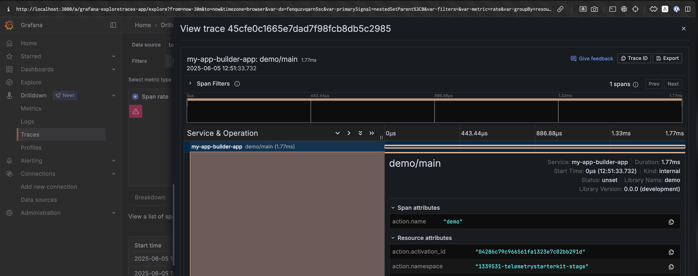

# OpenTelemetry Instrumentation with Grafana

<br />
<div align="center">
  
</div>
<br />

This guide demonstrates how to configure Grafana with App Builder runtime actions for both local development and deployed scenarios. We'll use a complete observability stack with Tempo (traces), Prometheus (metrics), and Loki (logs), all integrated through an OpenTelemetry Collector.

- [OpenTelemetry Instrumentation with Grafana](#opentelemetry-instrumentation-with-grafana)
  - [Prerequisites](#prerequisites)
  - [Local Development](#local-development)
    - [Setup](#setup)
    - [Docker Compose Configuration](#docker-compose-configuration)
    - [OpenTelemetry Collector Configuration](#opentelemetry-collector-configuration)
    - [Tempo Configuration](#tempo-configuration)
    - [Prometheus Configuration](#prometheus-configuration)
    - [Telemetry Configuration](#telemetry-configuration)
    - [Visualize the Data](#visualize-the-data)
  - [App Builder](#app-builder)
    - [Tunneling Setup](#tunneling-setup)
    - [Updated Telemetry Configuration](#updated-telemetry-configuration)

## Prerequisites

- Docker and Docker Compose
- An App Builder project with OpenTelemetry instrumentation.
- A tunneling tool for App Builder (see [Tunneling Guide](../support/tunnel-forwarding.md) for setup instructions). 
  - We'll be using Cloudflare Tunnel (cloudflared) for this example.

## Local Development

This section covers the complete setup for local development where both your actions and observability tools run locally.

### Architecture

- Runtime actions run locally via `aio app dev`
- Direct connection to local OpenTelemetry Collector on `localhost:4318`
- Full observability stack (Grafana, Tempo, Prometheus, Loki) runs in Docker
- All telemetry data flows through the collector for consistent processing

### Docker Compose Configuration

Create a `docker-compose.yml` file to run the complete observability stack:

```yaml
version: '3.8'
services:
  otel-collector:
    image: otel/opentelemetry-collector-contrib:latest
    container_name: otel-collector
    restart: unless-stopped
    volumes:
      - "./otel-collector-config.yaml:/etc/otelcol-contrib/config.yaml"
    ports: 
      - "4317:4317"
      - "4318:4318"
    networks: [telemetry]
    depends_on: [tempo, loki]

  tempo:
    image: grafana/tempo:latest
    container_name: tempo
    restart: unless-stopped
    volumes: 
      - "./tempo.yaml:/etc/tempo.yaml"
    networks: [telemetry]
    command: 
      - "-config.file=/etc/tempo.yaml"

  prometheus:
    image: prom/prometheus:latest
    container_name: prometheus
    restart: unless-stopped
    volumes: 
      - "./prometheus.yml:/etc/prometheus/prometheus.yml"
    ports: 
      - "9090:9090" # Prometheus UI
    networks: [telemetry]
    depends_on: [otel-collector]

  loki:
    image: grafana/loki:latest
    container_name: loki
    restart: unless-stopped
    networks: [telemetry]
    command: 
      - "-config.file=/etc/loki/local-config.yaml"

  grafana:
    image: grafana/grafana:latest
    container_name: grafana
    restart: unless-stopped
    ports: 
      - "3000:3000"
    volumes: 
      - "grafana-storage:/var/lib/grafana"
    networks: [telemetry]
    depends_on: [loki, prometheus, tempo]

networks:
  telemetry:
    driver: bridge

volumes:
  grafana-storage:
```

### OpenTelemetry Collector Configuration

Create an `otel-collector-config.yaml` file to configure how the collector processes and exports telemetry data:

```yaml
receivers:
  otlp:
    protocols:
      http:
        endpoint: 0.0.0.0:4318

      # Uncomment this if you want to use the gRPC protocol
      # grpc:
        # endpoint: 0.0.0.0:4317 

processors:
  batch:

exporters:
  # Traces to Tempo
  otlphttp/tempo:
    endpoint: http://tempo:4318

  # Metrics to Prometheus
  prometheus:
    endpoint: "0.0.0.0:8889"

  # Logs to Loki
  loki:
    endpoint: http://loki:3100/loki/api/v1/push

service:
  pipelines:
    traces:
      receivers: [otlp]
      processors: [batch]
      exporters: [otlp/tempo]
    
    metrics:
      receivers: [otlp]
      processors: [batch]
      exporters: [prometheus]
    
    logs:
      receivers: [otlp]
      processors: [batch]
      exporters: [loki]
```

### Tempo Configuration

Create a `tempo.yaml` file for trace storage configuration:

```yaml
server:
  http_listen_port: 3200

distributor:
  receivers:
    otlp:
      protocols:
        http:
          endpoint: 0.0.0.0:4318

ingester:
  trace_idle_period: 10s
  max_block_bytes: 100_000_000
  max_block_duration: 5m

compactor:
  compaction:
    block_retention: 1h

storage:
  trace:
    backend: local
    local:
      path: /tmp/tempo
    wal:
      path: /tmp/tempo/wal
```

### Prometheus Configuration

Create a `prometheus.yml` file to scrape metrics from the collector:

```yaml
global:
  scrape_interval: 15s

scrape_configs:
  - job_name: 'otel-collector-app-metrics'
    static_configs:
      - targets: ['otel-collector:8889']
```

### Telemetry Configuration

Configure your App Builder actions to send telemetry to the local collector:

```ts
// telemetry.ts
import {
  defineTelemetryConfig,
  getAioRuntimeResource,
  getPresetInstrumentations
} from "@adobe/aio-lib-telemetry";

import {
  OTLPTraceExporterProto,
  OTLPLogExporterProto,
  OTLPMetricExporterProto,
  PeriodicExportingMetricReader,
  SimpleLogRecordProcessor
} from "@adobe/aio-lib-telemetry/otel-api";

function localCollectorConfig(isDev: boolean) {
  return {
    // Not specifying any export URL will default to find an Open Telemetry Collector instance in localhost.
    traceExporter: new OTLPTraceExporterProto(),
    metricReader: new PeriodicExportingMetricReader({
      exporter: new OTLPMetricExporterProto(),
    }),
    
    logRecordProcessors: [
      new SimpleLogRecordProcessor(new OTLPLogExporterProto()),
    ]
  }
}

export const telemetryConfig = defineTelemetryConfig((params, isDev) => {
  // Direct connection to local OpenTelemetry Collector
  return {
    sdkConfig: {
      serviceName: "my-app-builder-app",
      instrumentations: getPresetInstrumentations("simple"),
      resource: getAioRuntimeResource(),

      ...localCollectorConfig(isDev),
    },
  };
});
```

## Visualize the Data

Start your observability stack with `docker compose up -d` and access Grafana at `http://localhost:3000`.

> [!NOTE]
> By default, the Grafana docker image will be protected with a username and password defaulting to `admin` for both fields. You'll need to change it upon first login. 
> 
> You can also disable authentication (not recommended), by specifying the following environment variables (in the `grafana` service):
> ```yaml
> environment:
>   - GF_AUTH_DISABLE_LOGIN_FORM=true
>   - GF_AUTH_ANONYMOUS_ENABLED=true
>   - GF_AUTH_ANONYMOUS_ORG_ROLE=Admin 
> ```

### Configure Data Sources

Go to **Configuration** → **Data Sources**, and for each of the components, click on  **Add data source**:

- **Tempo (Traces)**:
   1. Select **Tempo**
   2. Set URL to `http://tempo:3200`

- **Prometheus (Metrics)**:
   1. Select **Prometheus**
   2. Set URL to `http://prometheus:9090`

- **Loki (Logs)**:
   1. Select **Loki**
   2. Set URL to `http://loki:3100`


### Traces

Go to **Drilldown** and click on the **Traces** tab in the left sidebar. Initially, you may see an error message - this is normal since the default Grafana queries won't find any data yet. Ensure **Tempo** is selected as your data source. In the dashboard, look for the **Traces** tab where you'll find your different traces listed.


If you click on a trace, you'll see the details of the trace, including the spans that make up the trace and all the associated attributes. You can also copy the trace ID (in the top right corner) and use it to search the associated logs and metrics.



### Metrics

Navigate to **Drilldown** and select the **Metrics** tab from the left sidebar. Ensure **Prometheus** is selected as your data source. You'll likely see pre-configured visualizations displaying the metrics that Grafana has detected.


### Logs

Go to **Drilldown** and select the **Logs** tab from the left sidebar. Make sure **Loki** is set as your data source. Initially, you'll see a basic log preview interface. To access the full-featured log viewer with better navigation and configuration options, locate and click the "**Show Logs**" button.


## App Builder

For deployed App Builder actions, the setup is identical to Local Development with one key difference: **tunneling**. You'll use the same Docker stack locally, but expose the OpenTelemetry Collector through a tunnel so your deployed actions can reach it.

> [!CAUTION]
> **Hybrid Development Solution**: This section describes a hybrid "dev-in-prod" approach where you test deployed App Builder actions while keeping your observability tools local for easier debugging and development.
>
> **For real production deployments**, you would host your OpenTelemetry Collector and observability stack (Grafana, Tempo, Prometheus, Loki) on proper cloud infrastructure (AWS, Azure, GCP, etc.) and configure your App Builder actions to send telemetry directly to those hosted endpoints - no tunneling required.

### Tunneling Setup

For complete tunneling setup instructions, including tool comparisons and detailed configuration steps, see our dedicated [Tunneling Guide](../support/tunnel-forwarding.md).

The key steps are:

1. **Start your local stack** using the same Docker Compose configuration from the Local Development section

2. **Choose and start a tunnel** pointing to your OpenTelemetry Collector:
   ```bash
   # Example with Cloudflare Tunnel (recommended)
   docker run --rm -it --net=host cloudflare/cloudflared:latest tunnel --url http://localhost:4318
   ```

3. **Note the tunnel URL** that gets generated (e.g., `https://abc123-def456-ghi789.trycloudflare.com`)

#### Alternative: Add Tunneling to Docker Compose

If you prefer to manage everything through Docker Compose, add this service to your existing `docker-compose.yml`:

```yaml
  # Add this service to your existing docker-compose.yml
  cloudflared:
    image: cloudflare/cloudflared:latest
    container_name: cloudflared
    restart: unless-stopped
    networks: [telemetry]
    depends_on: [otel-collector]
    command: 
      - "tunnel"
      - "--url"
      - "http://otel-collector:4318"
```

Then start the new container:
```bash
docker compose up
```

Then, check the `cloudflared` container logs to get your tunnel URL:
```bash
docker logs cloudflared
```
Look for a line like: `https://abc123-def456-ghi789.trycloudflare.com` - this is the URL you'll use in your telemetry configuration.

### Updated Telemetry Configuration

Replace the default localhost collector configuration with the tunnel URL in your telemetry setup:

```ts
// telemetry-appbuilder.ts
import {
  defineTelemetryConfig,
  getAioRuntimeResource,
  getPresetInstrumentations
} from "@adobe/aio-sk-lib-telemetry";

import {
  OTLPTraceExporterProto,
  OTLPLogExporterProto,
  OTLPMetricExporterProto,
  PeriodicExportingMetricReader,
  SimpleLogRecordProcessor
} from "@adobe/aio-sk-lib-telemetry/otel-api";

function tunnelCollectorConfig(tunnelUrl: string) {
  const makeExporterConfig = (path: string) => ({
    url: `${tunnelUrl}/${path}`,
  });

  return {
    traceExporter: new OTLPTraceExporterProto(makeExporterConfig("v1/traces")),
    metricReader: new PeriodicExportingMetricReader({
      exporter: new OTLPMetricExporterProto(makeExporterConfig("v1/metrics")),
    }),
    logRecordProcessors: [
      new SimpleLogRecordProcessor(
        new OTLPLogExporterProto(makeExporterConfig("v1/logs"))
      ),
    ],
  };
}

export const telemetryConfig = defineTelemetryConfig((params, isDev) => {
  // Use the tunnel URL instead of localhost
  const tunnelUrl = "https://abc123-def456-ghi789.trycloudflare.com";

  return {
    sdkConfig: {
      serviceName: "my-app-builder-app",
      instrumentations: getPresetInstrumentations("simple"),
      resource: getAioRuntimeResource(),
      
      ...tunnelCollectorConfig(tunnelUrl),
    },
  };
});
```

That's it! Your deployed App Builder actions will now send telemetry through the tunnel to your local observability stack, where you can analyze traces, metrics, and logs using the same Grafana interface you set up for local development.