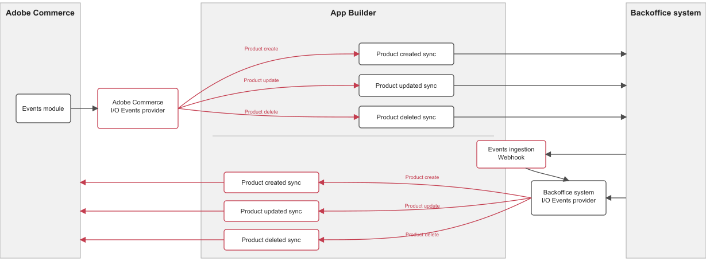

# Publish external back-office events through ingestion webhook.

It is an alternative method to deliver events for scenarios where the calling system cannot produce a request to interact directly with the event provider, such as:

- The client cannot add custom headers to the request

This runtime action exposes a web entry point to an external back office application for publishing information to IO events.

**This feature is turned off by default. To activate it**, uncomment the `ingestion` package block in `src/commerce-extensibility-1/ext.config.yaml`.



# Input information

Data parameters hold the event information to publish; each event must include entity, event, and value. The value parameter contains the data to send through the event.

- The entities available are [product, customer, customer-group, order, shipment, stock]
- The list of events available by an entity can be found in the `eventing` section of `app.commerce.config.ts`, under the `external` provider.

Here is the payload JSON sample:

```json
{
  "data": {
    "uid": "event_uid_1",
    "event": "be-observer.catalog_product_create",
    "value": {
      "sku": "PRODUCT_SKU",
      "name": "Product SKU",
      "price": 1,
      "description": "Product SKU description"
    }
  }
}
```

## Authentication

The webhook is not authenticated by default; you must implement your authentication check in the `checkAuthentication(params)` method in `src/commerce-extensibility-1/actions/ingestion/webhook/auth.js`.

## Use extra env parameters

You can access any needed environment parameter from `params`. Add the required parameter in the `src/commerce-extensibility-1/actions/ingestion/actions.config.yaml` under `webhook -> inputs` as follows:

```yaml
webhook:
  function: ./webhook/index.js
  web: "yes"
  runtime: nodejs:24
  inputs:
    LOG_LEVEL: $LOG_LEVEL
    AIO_COMMERCE_AUTH_IMS_CLIENT_ID: $AIO_COMMERCE_AUTH_IMS_CLIENT_ID
    AIO_COMMERCE_AUTH_IMS_CLIENT_SECRETS: $AIO_COMMERCE_AUTH_IMS_CLIENT_SECRETS
    AIO_COMMERCE_AUTH_IMS_TECHNICAL_ACCOUNT_ID: $AIO_COMMERCE_AUTH_IMS_TECHNICAL_ACCOUNT_ID
    AIO_COMMERCE_AUTH_IMS_TECHNICAL_ACCOUNT_EMAIL: $AIO_COMMERCE_AUTH_IMS_TECHNICAL_ACCOUNT_EMAIL
    AIO_COMMERCE_AUTH_IMS_ORG_ID: $AIO_COMMERCE_AUTH_IMS_ORG_ID
    AIO_COMMERCE_AUTH_IMS_SCOPES: $AIO_COMMERCE_AUTH_IMS_SCOPES

    HERE_YOUR_PARAM: $HERE_YOUR_PARAM_ENV

  annotations:
    require-adobe-auth: false
    final: true
```
