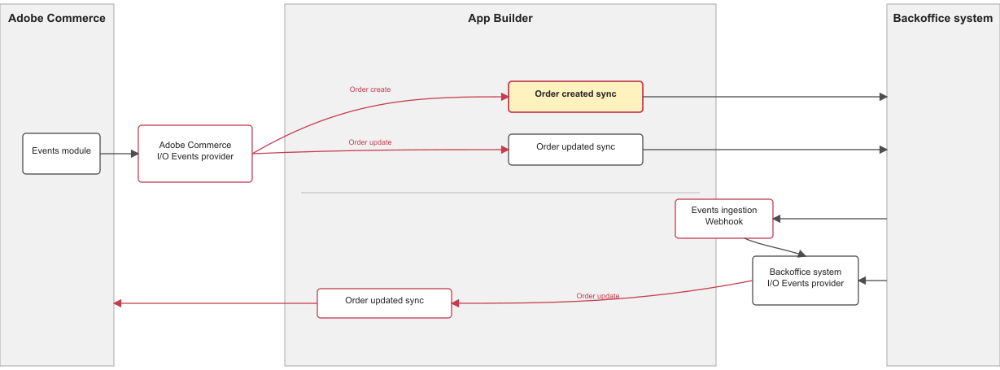

# Integrate Adobe Commerce order-created event with a third party.

This runtime action is responsible for notifying the integration with the external back-office application after an order is created in Adobe Commerce.



# Incoming event payload

The incoming event payload depends on the fields specified during the event registration in Adobe Commerce. For more information, please check it here: https://developer.adobe.com/commerce/extensibility/events/configure-commerce/#subscribe-and-register-events.
Here is a payload example of the data received in the event:

```json
{
  "real_order_id": "ORDER_ID",
  "increment_id": "ORRDER_INCREMENTAL_ID",
  "items": [
    {
      "item_id": "ITEM_ID"
    }
  ],
  "created_at": "2000-01-01",
  "updated_at": "2000-01-01"
}
```

There is other interesting information that you can access from `params`, like the event type and event ID.

## Connect with the 3rd party

The `sendData` function in the `sender.js` file defines the connection with the third party.
Please include all the authentication and connection login on that `sender.js` file or an extracted file outside `index.js`.
Any values from the environment could be accessed from `params`. Pass the required parameters by the action by configuring them in the `src/commerce-extensibility-1/actions/order/commerce/actions.config.yaml` under `created -> inputs` as follows:

```yaml
created:
  function: commerce/created/index.js
  web: "no"
  runtime: nodejs:24
  inputs:
    LOG_LEVEL: $LOG_LEVEL
    HERE_YOUR_PARAM: $HERE_YOUR_PARAM_ENV
  annotations:
    final: true
```
