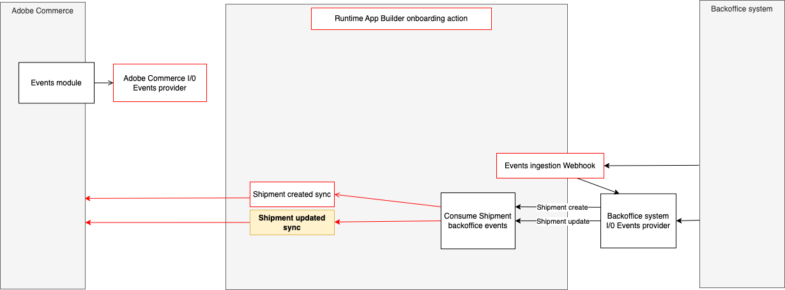

# Integrate a third-party shipment updated event with Adobe Commerce.

This runtime action is responsible for notifying the integration with Adobe Commerce after a shipment is updated in the 3rd party.



# Incoming event payload

The incoming event payload depends on the third party API and entity model.
Here is a payload example of the data received in the event:

```json
{
  "id": 32,
  "orderId": 7,
  "items": [
    {
      "entityId": 18,
      "orderItemId": 7,
      "qty": 1
    }
  ],
  "tracks": [
    {
      "entityId": 18,
      "trackNumber": "Custom Value",
      "title": "Custom Title",
      "carrierCode": "custom"
    }
  ],
  "comments": [
    {
      "entityId": 18,
      "notifyCustomer": false,
      "comment": "Order Shipped from API",
      "visibleOnFront": true
    }
  ],
  "stockSourceCode": "default"
}
```

# Data validation

The incoming data is validated against a JSON schema defined in the `schema.json` file.
Here's an example:

```json
{
  "type": "object",
  "properties": {
    "id": { "type": "number" },
    "orderId": { "type": "number" },
    "items": {
      "type": "array",
      "items": {
        "type": "object",
        "properties": {
          "entityId": { "type": "number" },
          "orderItemId": { "type": "number" },
          "qty": { "type": "number" }
        },
        "required": ["entityId", "orderItemId", "qty"],
        "additionalProperties": false
      }
    },
    "tracks": {
      "type": "array",
      "items": {
        "type": "object",
        "properties": {
          "entityId": { "type": "number" },
          "trackNumber": { "type": "string" },
          "title": { "type": "string" },
          "carrierCode": { "type": "string" }
        },
        "required": ["entityId", "trackNumber", "title", "carrierCode"],
        "additionalProperties": false
      }
    },
    "comments": {
      "type": "array",
      "items": {
        "type": "object",
        "properties": {
          "entityId": { "type": "number" },
          "notifyCustomer": { "type": "boolean" },
          "comment": { "type": "string" },
          "visibleOnFront": { "type": "boolean" }
        },
        "required": ["entityId", "notifyCustomer", "comment", "visibleOnFront"],
        "additionalProperties": false
      }
    },
    "stockSourceCode": { "type": "string" }
  },
  "required": [
    "id",
    "orderId",
    "items",
    "tracks",
    "comments",
    "stockSourceCode"
  ],
  "additionalProperties": false
}
```

## Interact with the Adobe Commerce API

The `sendData` function in the `sender.js` file defines the interaction with the Adobe Commerce API.
This function delegates to the `updateShipment` method in the `src/commerce-extensibility-1/actions/order/commerce-shipment-api-client.js` interaction with the Commerce API.
Any parameters needed from the execution environment could be accessed from `params`.
These parameters can be passed on the action by configuring them in the `src/commerce-extensibility-1/actions/order/external/actions.config.yaml` under `shipment-updated -> inputs` as follows:

```yaml
shipment-updated:
  function: updated/index.js
  web: "no"
  runtime: nodejs:24
  inputs:
    LOG_LEVEL: $LOG_LEVEL
    AIO_COMMERCE_AUTH_IMS_CLIENT_ID: $AIO_COMMERCE_AUTH_IMS_CLIENT_ID
    AIO_COMMERCE_AUTH_IMS_CLIENT_SECRETS: $AIO_COMMERCE_AUTH_IMS_CLIENT_SECRETS
    AIO_COMMERCE_AUTH_IMS_TECHNICAL_ACCOUNT_ID: $AIO_COMMERCE_AUTH_IMS_TECHNICAL_ACCOUNT_ID
    AIO_COMMERCE_AUTH_IMS_TECHNICAL_ACCOUNT_EMAIL: $AIO_COMMERCE_AUTH_IMS_TECHNICAL_ACCOUNT_EMAIL
    AIO_COMMERCE_AUTH_IMS_ORG_ID: $AIO_COMMERCE_AUTH_IMS_ORG_ID
    AIO_COMMERCE_AUTH_IMS_SCOPES: $AIO_COMMERCE_AUTH_IMS_SCOPES
  annotations:
    final: true
```
